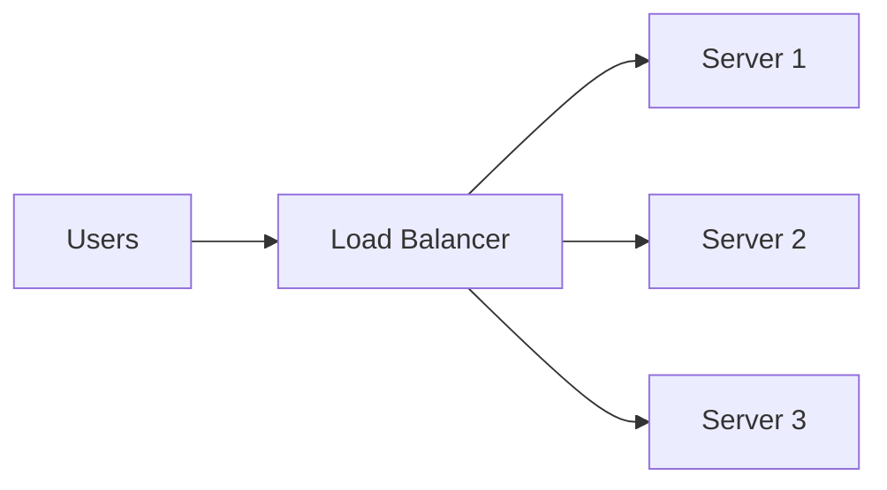
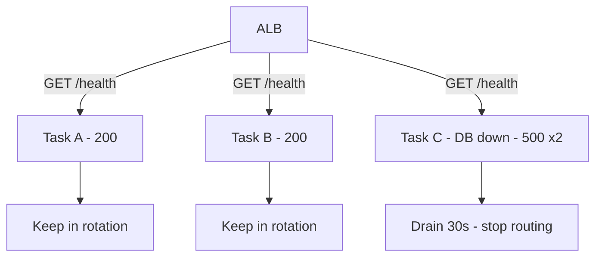
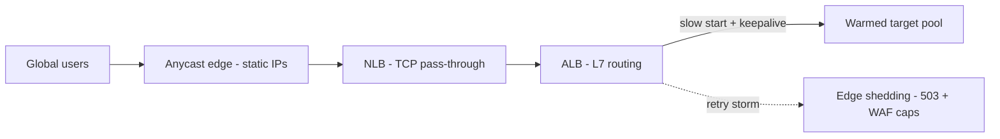

# Load Balancers: Basics to Architect

## Level 1 — Basics

A load balancer sits between users and your servers and does two jobs: **spread requests** across healthy servers, and **stop sending traffic to dead ones**. Without one, a single server is a single point of failure; with a misconfigured one, you just moved the single point of failure.

Core vocabulary: **listener** (port/protocol it accepts), **target group** (the servers), **health check** (how it decides "dead"). If you understand those three, you understand 80% of load balancing.

## Level 2 — Production practitioner

### L4 vs L7: the decision

| | L4 / NLB | L7 / ALB |
|---|---|---|
| Sees | TCP/UDP connections | HTTP requests, headers, paths |
| Routes by | IP + port | Host, path, header, query |
| TLS | Pass-through or terminate | Terminate + smart routing |
| Use when | Games, IoT, raw TCP, static IPs | APIs, microservices, web apps |

Default to ALB for HTTP; NLB for non-HTTP or static IPs.

### Health checks that don't lie

The LB is only as good as its definition of "healthy":

1. **Check the real dependency path.** `/health` should touch what serving traffic needs (DB pool, critical downstream). A static `200 OK` only proves the process is alive.
2. **Separate liveness from readiness.** Starting tasks shouldn't get traffic yet; shutting-down tasks should finish in-flight requests (deregistration delay ~30s).
3. **Tune to deploy speed.** `healthy 2 / unhealthy 2 / 15-30s interval` is sane; tighten only with data, since aggressive checks flap during deploys.

### Cross-zone and stickiness

- ALB cross-zone is always on; NLB's is off by default and costs cross-AZ transfer when on. Keep it on unless the bill proves otherwise — uneven AZ load is a weirder outage than a line item.
- Sticky sessions are a smell: they mean server-side state. Externalize sessions (Redis/DynamoDB) instead; stickiness breaks even scaling.

## Level 3 — Architect: millions of requests

At millions of RPS / tens of Gbps, the LB layer itself becomes the system to design:

- **Pre-warming.** LBs scale with traffic, but not instantly. A flash sale that jumps 10x in a minute outruns scale-up — traffic gets throttled at the LB, not the app. Pre-warm (ask support / plan the ramp) before known spikes.
- **Static IPs + Anycast.** ALB IPs change; clients that pin IPs (IoT fleets, partner firewalls) break. Front with NLB (static EIPs) or Global Accelerator (anycast edge) → ALB → targets. This "NLB sandwich" is the standard millions-scale front door.
- **Connection reuse.** LB→target connection setup is overhead per request. Keepalives (target and client side), tuned idle timeouts (ALB default 60s — raise for long-poll/WS), and HTTP/2/gRPC end-to-end cut connection churn by orders of magnitude.
- **Slow start.** New targets get full traffic instantly and melt under cold caches. Slow-start mode ramps a target 30s→N min. Mandatory behind every autoscaled pool.
- **Thundering-herd protection.** Retry storms multiply load (3 retries × 2 LB layers = 9x). Cap retries with budgets, add jittered backoff, and shed at the edge (WAF rate rules / LB 503s) rather than letting the flood reach the app.
- **Header/size limits as armor.** ALB header and body limits, WAF rules, and request-size caps turn volumetric junk into cheap 4xx rejections at the edge.

## Rule of thumb

**Basics: spread + detect. Production: honest health checks, draining, no stickiness. Millions: pre-warm the ramp, static-IP front door, keepalives everywhere, slow-start every pool, shed floods at the edge — the LB tier is infrastructure, so design it like infrastructure.**
