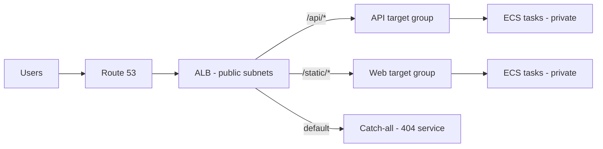
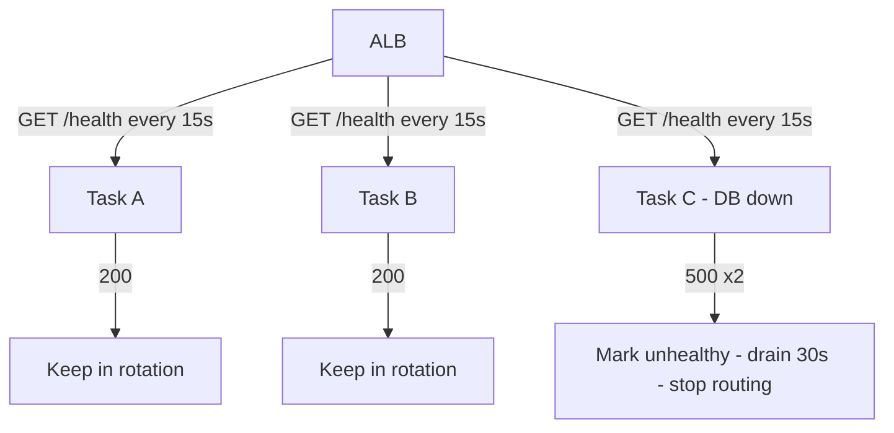

# Load Balancers

A load balancer is two things: a **traffic cop** (spread requests) and a **failure detector** (stop sending traffic to dead targets). The second job matters more. Most outages blamed on "the app" are really health checks that lied.

## L4 vs L7: the only decision that matters

| | L4 (NLB) | L7 (ALB) |
|---|---|---|
| Sees | TCP/UDP connections | HTTP requests, headers, paths |
| Routes by | IP + port | Host, path, header, query |
| TLS | Pass-through or terminate | Terminate + smart routing |
| Speed | Extreme (millions of RPS) | High, slightly more latency |
| Use when | Games, IoT, raw TCP, static IPs | APIs, microservices, web apps |

Rule of thumb: **default to ALB for HTTP workloads; reach for NLB only for non-HTTP protocols or when you need static IPs / PrivateLink.**

## Health checks that actually work

A load balancer is only as good as its definition of "healthy":

1. **Check the real dependency path.** `/health` should touch what serving traffic needs (DB connection pool, critical downstream). A static `200 OK` only proves the process is alive.
2. **Separate liveness from readiness.** A task starting up should not receive traffic yet; a task shutting down should finish in-flight requests (deregistration delay / connection draining).
3. **Tune thresholds to your deploy speed.** Aggressive intervals (5s) detect failure fast but flap during deployments. `healthy 2 / unhealthy 2 / 30s interval` is a sane default; tighten only with data.

## Cross-zone load balancing: free resilience, small bill

With cross-zone **on**, each LB node spreads evenly to targets in *all* AZs. With it **off**, each node spreads only within its own AZ — one AZ with fewer tasks gets hammered.

- ALB: cross-zone always on.
- NLB: off by default, turning it on incurs cross-AZ data charges.

Rule of thumb: **keep cross-zone on unless you measured the data-transfer bill and it hurts.** Uneven AZ load is a weirder, harder outage to debug than a line item.

## Sticky sessions: a smell, not a feature

If you need stickiness, your app holds state on the server. Fix that first (externalize sessions to Redis/DynamoDB, make requests stateless). Stickiness breaks even scaling and turns one hot task into everyone's problem. The ALB knob exists for legacy migrations, not greenfield.

## Connection draining on deploy

When a target goes unhealthy or a deploy replaces it: stop *new* connections immediately, let *in-flight* ones finish for N seconds (deregistration delay, e.g. 30s), then kill. Zero-downtime deploys are 90% this setting plus a `/health` that fails fast on shutdown signal.

## Rule of thumb

**The LB config is a reliability contract: path-based routing, honest health checks, draining on shutdown. Get those three right and most "scaling" problems disappear before autoscaling is even involved.**
