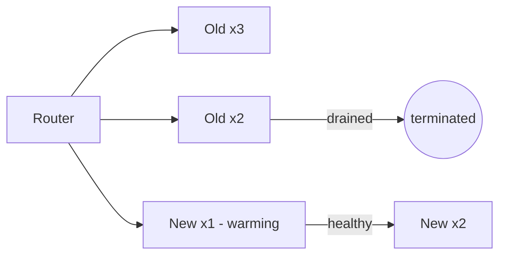
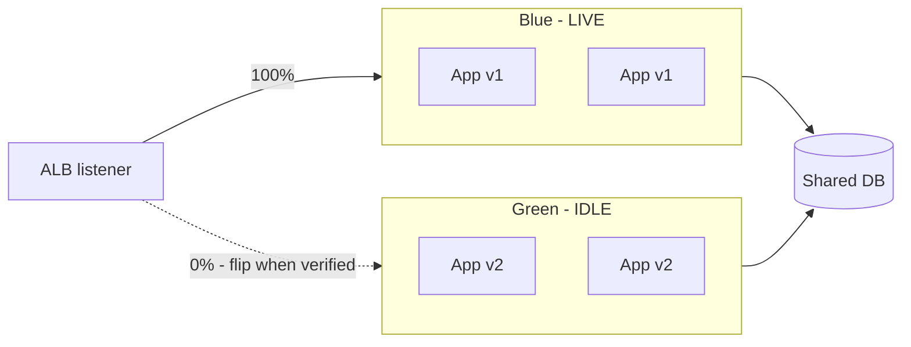

# Deployment Strategies

Every strategy answers two questions: **how fast do users get the new version?** and **how fast can I take it back?** Optimize for the second one. Rollback speed is the real SLA of a deploy pipeline.

## The lineup

| Strategy | How | Rollback | Downtime | Cost |
|---|---|---|---|---|
| Recreate | Stop all, start new | Redeploy old (slow) | Yes | 1x |
| Rolling | Replace N at a time | Slow (re-roll) | No | ~1x |
| Blue-Green | Full parallel stack, flip router | Instant (flip back) | No | 2x during switch |
| Canary | 1-5% traffic to new, widen gradually | Instant (shift to 0%) | No | ~1x + analysis |
| A/B | Like canary, but measures *behavior* | Instant | No | ~1x + metrics |
| Shadow | Mirror live traffic, discard responses | N/A (no user impact) | No | 2x load |

## Rolling: the default that is usually enough

Kubernetes Deployments and ECS rolling updates do this. Guardrails that make it safe:

- `maxUnavailable: 0` (or min-healthy 100%) — never shrink capacity mid-deploy.
- Readiness gates — new pods serve traffic only when `/health` passes.
- Automatic rollback on failed rollout (progress deadline / circuit breaker).

## Blue-Green: pay double, sleep well

Two full environments; the router (ALB target group, Route 53 weighted record) points at one. Deploy to idle, smoke-test it with real traffic shape, flip, keep old warm for one TTL/window, then drain.

Best for: stateful-ish services, risky migrations, compliance windows where "revert in <60s" is the requirement. Worst for: tight budgets, data-layer changes (the DB is shared anyway — see below).

## Canary: rolling with a brain

Ship to 1%, watch error rate/latency/business metrics against baseline, widen in steps (1 → 10 → 50 → 100), auto-halt on regression. Needs real metrics plumbing (this is where Datadog/SLOs earn their keep). Without automated analysis a canary is just a slow rolling deploy with extra steps.

## The database problem nobody diagrams

App versions are easy; **schemas are the hard part**. All strategies above assume the deploy is code-only. Rules:

1. Expand before contract: migrations add (nullable columns, new tables) — never rename/drop in the same release the code stops using them.
2. Code must tolerate both schemas during the transition window.
3. Destructive changes ship one release *later*, after old code is gone.

## Rollback SOP (tape this to the wall)

1. Flip traffic first (target group weights / DNS / flag), ask questions later. Target: <5 min.
2. Then investigate on the idle stack with production-shaped traffic available for repro.
3. Then decide: fix-forward on idle, or re-deploy old artifact as new release (never "un-deploy" — always deploy something known-good).

## Rule of thumb

**Rolling for everyday services, blue-green when instant rollback is the requirement, canary when you have metrics worth gating on. And no strategy survives a coupled schema change — expand/contract always.**
