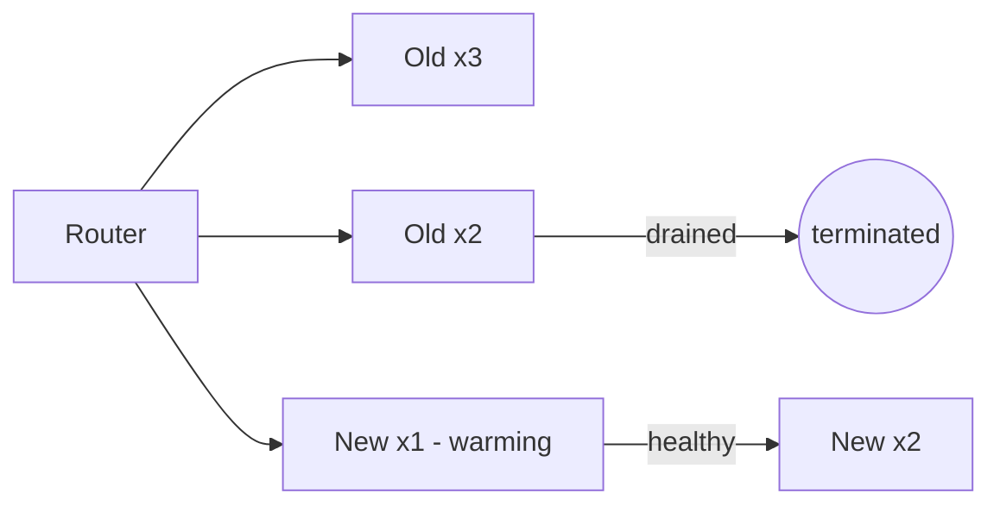
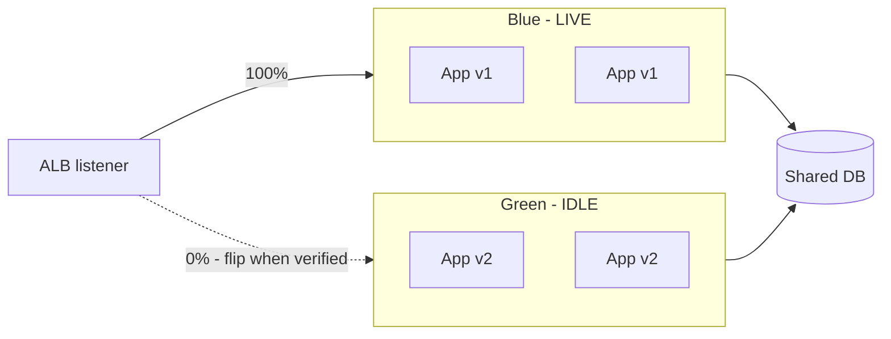
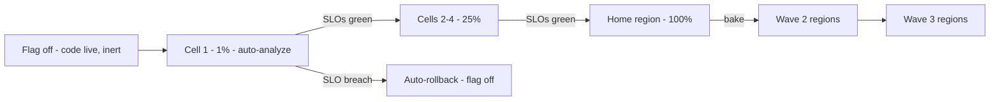

# Deployment Strategies: Basics to Architect

## Level 1 — Basics

Deploying means replacing old code with new code on live servers. Every strategy answers two questions: **how fast do users get the new version?** and **how fast can I take it back?** Beginners optimize the first; experience optimizes the second. Rollback speed is the real SLA of a deploy pipeline.

Naive deploy (stop everything, start new) causes downtime and slow recovery. Everything below is a refinement that removes downtime, speeds rollback, or both.

## Level 2 — Production practitioner

### The lineup

| Strategy | How | Rollback | Downtime | Cost |
|---|---|---|---|---|
| Recreate | Stop all, start new | Redeploy old (slow) | Yes | 1x |
| Rolling | Replace N at a time | Slow (re-roll) | No | ~1x |
| Blue-Green | Full parallel stack, flip router | Instant (flip back) | No | 2x during switch |
| Canary | 1-5% traffic, widen gradually | Instant (shift to 0%) | No | ~1x + analysis |
| A/B | Like canary, measures *behavior* | Instant | No | ~1x + metrics |
| Shadow | Mirror traffic, discard responses | N/A | No | 2x load |

### Rolling (the default)

Kubernetes Deployments / ECS rolling updates. Guardrails: `maxUnavailable: 0`, readiness gates on `/health`, automatic rollback on failed rollout (progress deadline / circuit breaker).

### Blue-Green (instant rollback)

Two full stacks; router (ALB target group / Route 53 weights) points at one. Deploy idle, smoke with real traffic shape, flip, keep old warm one window, drain. Pay 2x during switch; buy <60s revert.

### Canary (rolling with a brain)

1% → watch errors/latency/business metrics vs baseline → widen in steps → auto-halt on regression. Without automated analysis it's just a slow rolling deploy with extra steps.

### The database problem

App versions are easy; schemas are hard. Rules: **expand before contract** (add nullable, never rename/drop in the same release), code tolerates both schemas during transition, destructive changes ship one release later.

### Rollback SOP

Flip traffic first (<5 min target), investigate on the idle stack, then fix-forward or re-deploy the old artifact as a new release. Never "un-deploy."

## Level 3 — Architect: deploys at millions-scale traffic

When a deploy touches thousands of hosts across regions serving millions of RPS, the strategy becomes a control system:

- **Feature flags > deploy strategies.** Decouple *shipping code* from *releasing behavior*. Dark-launch to prod daily; flags ramp exposure per user/region. A bad flag flips off in seconds with zero redeploy — faster than any blue-green flip.
- **Progressive delivery with automated analysis.** Canary stages gated by SLOs (error budget burn, p99, business KPIs), auto-promote or auto-rollback with no human in the loop. Humans approve stage *policy*, not each release.
- **Cell-based rollouts.** Divide the fleet into cells (failure-isolated slices); roll cell by cell with bake time between. A bad build kills one cell, never the fleet. Same cells double as your blast-radius story.
- **Regional sequencing.** Never deploy all regions at once: home region first (full team awake), bake, then wave outward following the sun. One region's incident is contained by construction.
- **Schema migration at millions of rows.** Online schema change tools (gh-ost/OSC-style: shadow table, trickle-copy, cutover) — `ALTER TABLE` on a hot multi-TB table locks writes and *is* the outage. Backfill in batches with throttling; verify row counts before cutover.
- **Deploy freezes as code.** Freeze windows (peak events, holidays) enforced by pipeline policy, with a break-glass path that pages leadership. Culture can't hold a freeze; gates can.
- **Heterogeneous fleet discipline.** At scale old and new versions coexist for a long time (long-tail clients, stuck AZs). Version-skew budgets ("no more than 2 versions live"), protocol backward-compat, and forced-drain deadlines keep the fleet convergent.

## Rule of thumb

**Basics: rollback speed over release speed. Production: rolling by default, blue-green for instant revert, canary with real metric gates, expand/contract schemas. Millions: flags decouple ship from release, cells + regional waves contain blasts, online migrations for big tables — the deploy system is a control loop, so automate the loop and approve the policy.**
