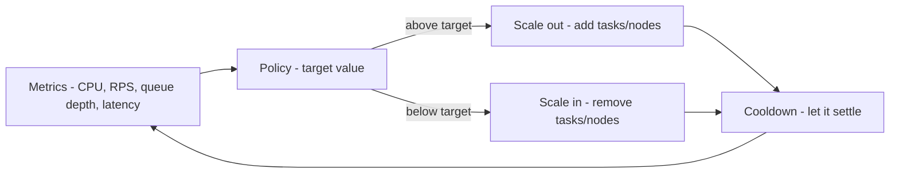

# Auto Scaling

Autoscaling is a control loop: **measure → compare to target → add/remove capacity → wait → repeat.** Every scaling incident is one of three bugs: measuring the wrong thing, reacting too fast, or capacity that cannot appear in time.

## Scale the right signal

| Signal | Good for | Trap |
|---|---|---|
| CPU | Compute-bound services | Async/IO-bound apps sit at 20% CPU while drowning |
| Requests per target | Web APIs behind ALB | Needs ALB request-count metrics wired in |
| Queue depth / lag | Workers, consumers | Must scale on *per-consumer* lag, not total |
| Latency (p99) | User-facing SLOs | Lagging indicator — you scale after users hurt |
| Custom business metric | Spiky domains (emails/min) | You own the metric pipeline now |

Rule of thumb: **prefer queue-depth-per-consumer for workers and requests-per-target for APIs; CPU is a fallback, latency is an alarm, not a scaling signal.**

## The Kubernetes trio

- **HPA** — scales replica count from metrics. Bread and butter.
- **VPA** — recommends/sets requests/limits. Run it in *recommendation mode* first; auto-applying VPA restarts pods and fights HPA.
- **Cluster autoscaler / Karpenter** — scales nodes under the pods. HPA without node capacity just creates Pending pods.

All three must agree: requests/limits sized from load tests (not guesses), HPA target ~60-70% (headroom for spikes), node pool that grows faster than pods do.

## ECS + serverless equivalents

- ECS Service Auto Scaling: target-tracking on CPU or ALB requests-per-target, min/max tasks, same cooldown logic.
- Aurora Serverless v2: capacity (ACUs) floats with load — set a floor that avoids cold starts, a ceiling that avoids bill shock.
- Fargate: no nodes to manage, but cold starts and per-task overhead are the price.

## Cooldowns and flapping

After scaling out, metrics take minutes to settle; scaling in too eagerly causes oscillation (add → overshoot → remove → spike → add). Cooldowns (e.g. 60s out, 300s in) and step policies (add 1 first, more if still breaching) exist for this. Scale-in should always be slower and more conservative than scale-out.

## Capacity that cannot appear in time

Autoscaling is not instant: images pull, tasks warm, DB connections open, caches fill cold. For known peaks (sales, launches, Black Friday):

1. **Pre-scale** before the event (scheduled scaling), then let the loop hold it.
2. **Pre-warm** caches and connection pools.
3. **Reserve** capacity (Savings Plans / reservations) for the baseline you now know.

## Scale-to-zero: handle with care

Great for batch/cron/dev. Terrible for latency-sensitive paths (cold start on the critical request). If you scale to zero, the first request pays the startup bill — make sure someone explicitly accepted that.

## Rule of thumb

**Right-size first (load tests, not guesses), scale on the signal closest to user pain, cool down longer on the way in, and pre-scale anything you can see coming. Autoscaling handles the surprise — planning handles the calendar.**
