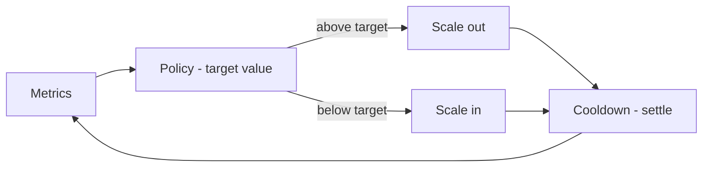
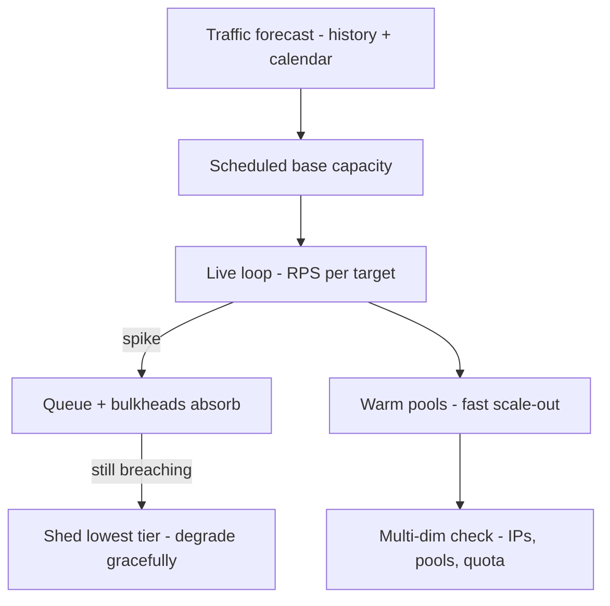

# Auto Scaling: Basics to Architect

## Level 1 — Basics

Traffic goes up and down; fixed capacity either wastes money (idle servers) or drops requests (overload). Autoscaling is a control loop: **measure → compare to target → add/remove capacity → wait → repeat.**

Every scaling incident is one of three bugs: measuring the wrong thing, reacting too fast, or capacity that can't appear in time.

## Level 2 — Production practitioner

### Scale the right signal

| Signal | Good for | Trap |
|---|---|---|
| CPU | Compute-bound services | IO-bound apps drown at 20% CPU |
| Requests per target | Web APIs behind ALB | Must wire ALB request-count metrics |
| Queue depth per consumer | Workers/consumers | Total lag lies; per-consumer lag tells truth |
| Latency p99 | Alarms | Lagging — you scale after users hurt |
| Business metric | Spiky domains | You now own that metric pipeline |

Prefer queue-depth-per-consumer (workers) and requests-per-target (APIs); CPU is a fallback.

### The Kubernetes trio + serverless equivalents

- **HPA** scales replicas; **VPA** recommends/sets requests-limits (run recommend-mode first — auto-apply restarts pods and fights HPA); **Cluster Autoscaler/Karpenter** scales nodes (HPA without node capacity just makes Pending pods).
- ECS Service Auto Scaling = same loop on tasks. Aurora Serverless v2 = capacity floats with load (floor against cold starts, ceiling against bill shock).

### Cooldowns and known peaks

Scale-in slower than scale-out (e.g. 60s out / 300s in) to avoid oscillation. For predictable peaks: **pre-scale** (scheduled), **pre-warm** (caches, pools), **reserve** baseline capacity. Autoscaling handles surprise; planning handles the calendar.

## Level 3 — Architect: scaling for millions

At millions of RPS, reactive task-count scaling is necessary but nowhere near sufficient. The architect's toolkit:

- **Predictive + scheduled over purely reactive.** Daily/weekly traffic shapes are known — feed history into scheduled scaling so capacity exists *before* the ramp. Reactive loop then handles only the delta. Fewer cold tasks, fewer p99 spikes at the top of every hour.
- **Headroom math.** Run hot (80%+) and any spike queues; run cold (30%) and you burn budget. Size steady-state ~50-60% with burst headroom for 2x, and prove it with load tests at 3-5x normal — not with spreadsheets.
- **Backpressure and load shedding.** When demand exceeds max capacity, *choose* what fails: concurrency limits per downstream, queue bounds with overflow policy (drop + metric, never unbounded growth), API rate limits by tier, and graceful degradation (disable recommendations, serve cached/stale) before random 500s. Shedding is a feature with a runbook, not an accident.
- **Partition the work.** One giant queue + one scaler = one blast radius. Shard queues/consumers by tenant/hash so a hot key scales its own lane without starving others. Same for connection pools per downstream (bulkheads).
- **Warm pools and provisioned concurrency.** Cold starts compound at scale (thousands of tasks × seconds = minutes of degraded p99). Warm pools, provisioned concurrency for functions, and pre-baked images (no `npm install` at boot) keep scale-out latency in seconds.
- **Multi-dimensional scaling.** Requests scale tasks; tasks need nodes, IPs (subnet exhaustion is a real outage), DB connections (pool limits!), and downstream quota. Scale the *binding constraint*: pre-size subnets, pool with PgBouncer/RDS Proxy, and raise downstream limits before the event.
- **Cost control at scale.** At millions of requests, 10% overprovisioning is a headcount. Savings Plans for baseline, Spot/Fargate-Spot for fault-tolerant tiers, Karpenter consolidation, and continuous rightsizing (VPA data → smaller requests → binpack tighter). FinOps is an architecture input, not a finance afterthought.

## Rule of thumb

**Basics: measure, compare, wait. Production: right signal, slow scale-in, pre-scale the calendar. Millions: predict the base, shed by policy, partition hot lanes, warm the pool, scale every dimension (IPs, connections, quota) — and treat the 10% waste as an architecture bug, because at scale it is one.**
