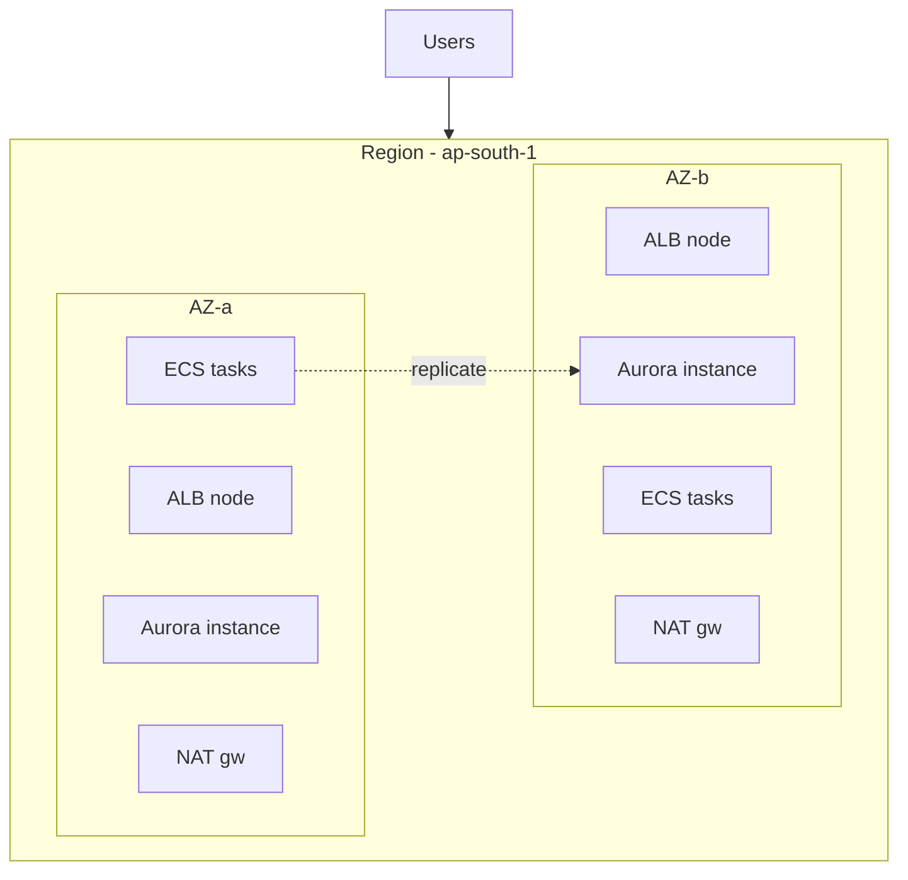

# Availability Zones

An Availability Zone is an isolated failure domain: separate building, power, cooling, network. A region is a set of AZs close enough for single-digit-ms latency. **Multi-AZ is not disaster recovery** (a region event still takes you down) — it is protection against the common case: one building having a bad day.

## What actually goes multi-AZ

- **Load balancer nodes** — one per AZ, always. This is free with ALB.
- **Compute** — tasks/pods spread evenly (anti-affinity / AZ-balanced subnets). Two tasks in one AZ is one AZ of capacity.
- **Data** — RDS Multi-AZ standby, Aurora replicas across AZs, ElastiCache with replicas. An AZ failure should cause a failover, not data loss.
- **Egress** — one NAT gateway per AZ. A single shared NAT is a single point of failure *and* a cross-AZ data-transfer tollbooth. (Dev can use one NAT to save ~$32/mo; prod never should.)

## The blast-radius ladder

Think in tiers and make each tier narrower than the last:

1. **Task/pod** — dies constantly, nobody notices (health checks + replacements).
2. **Node** — pods reschedule; needs spare headroom.
3. **AZ** — traffic shifts; needs cross-AZ capacity (run at N+1 AZs of headroom).
4. **Region** — DNS failover / Global DB (see DR guide).
5. **Dependency** — the cloud service itself is down; degrade gracefully (cached reads, queued writes).

If your design handles tier N, test tier N-1 with game days. Most teams claim tier 3 and have never killed an AZ.

## The costs people forget

- **Cross-AZ data transfer** — replicas, cross-zone LB traffic, and chatty services add up. Keep data-local where you can (AZ-aware routing, local caches).
- **Quorum math** — etcd/ZooKeeper-style systems need 3 AZs for real quorum (2 AZs cannot safely elect). If you run your own control planes, use 3 AZs.
- **Minimum 2, prefer 3** — two AZs survive one failure; three let you lose one *and* deploy/maintain through it.

## Game-day checklist (run quarterly)

- [ ] Kill all tasks in one AZ — traffic shifts, p99 barely moves.
- [ ] Fail over the database — app reconnects, writes resume <60s.
- [ ] Remove one NAT gateway — egress continues via the other AZ.
- [ ] Fill a disk / OOM a node — pods reschedule, no alert fatigue from noise.

## Rule of thumb

**Two AZs minimum, three for anything with quorum. Spread compute, replicate data, NAT per AZ — and prove it quarterly by breaking one AZ on purpose. Untested multi-AZ is a diagram, not a capability.**
