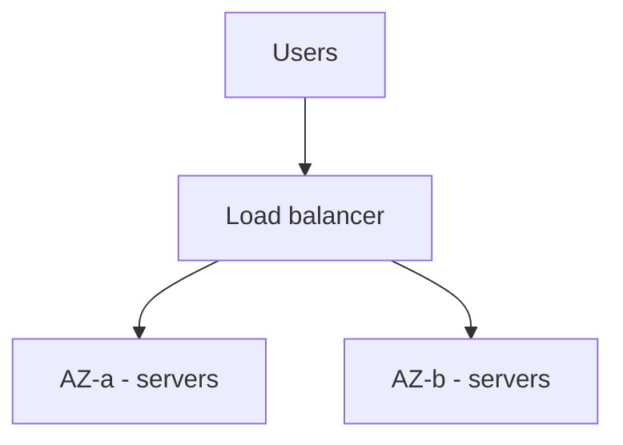
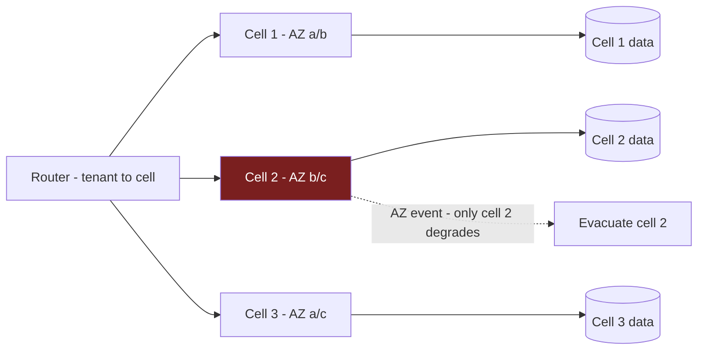

# Availability Zones: Basics to Architect

## Level 1 — Basics

Cloud data centers fail: power, cooling, bad deploys, backhoe vs fiber. An **Availability Zone** is an isolated building (own power/cooling/network); a **region** is AZs close enough for single-digit-ms latency. Spreading servers across AZs means one building's bad day isn't your outage.

Key idea: **failure domains nest** — task < node < AZ < region < provider. Each level needs its own answer.

## Level 2 — Production practitioner

### What goes multi-AZ (all of it)

- **LB nodes** — one per AZ (free with ALB).
- **Compute** — tasks/pods spread evenly; two tasks in one AZ is one AZ of capacity.
- **Data** — RDS Multi-AZ standby, Aurora cross-AZ replicas; AZ loss = failover, not data loss.
- **Egress** — NAT gateway per AZ. One shared NAT is a single point of failure *and* a cross-AZ tollbooth. (Single NAT is fine in dev to save ~$32/mo; never in prod.)

### Costs people forget

- **Cross-AZ transfer** — replicas, cross-zone traffic, chatty services. Keep data-local (AZ-aware routing, local caches).
- **Quorum needs 3 AZs** — etcd-style systems can't safely elect with 2. If you run control planes, use 3.
- **Minimum 2, prefer 3** — two AZs survive one failure; three let you lose one *and* deploy through it.

### Game days (quarterly)

Kill an AZ's tasks, fail over the DB, remove a NAT — traffic shifts, p99 barely moves. Untested multi-AZ is a diagram, not a capability.

## Level 3 — Architect: fault isolation at millions-scale

When one AZ holds hundreds of hosts and millions of users, "spread evenly" just means *everyone* feels *every* AZ wobble. Architects shrink the blast radius instead of spreading it:

- **Cell-based architecture.** Partition users/traffic into cells — each cell is a full, isolated slice (own compute, own data partition, own deploy pipeline). An AZ event, bad deploy, or hot tenant hits one cell. Route by cell (header/tenant shard), keep cells small enough that losing one is a support ticket, not an incident. Same cells gate your progressive rollouts.
- **Shuffle sharding.** Stronger than cells for shared fleets: each customer is assigned a random *subset* (shard) of hosts. Blast radius shrinks combinatorially — with 100 hosts and shard size 5, one host failure touches a fraction of customers, and no two customers share the exact same fate. AWS uses this for Route 53/DynamoDB-scale isolation.
- **Zonal shift / evacuation.** With ARC-style zonal shift, you move traffic off a sick AZ in one action (DNS + LB weight change), without waiting for health-check convergence. Design for *evacuation*: any AZ must be drainable in minutes with N-1 capacity elsewhere.
- **Static stability.** The failover path must not depend on the thing that's failing: pre-provisioned N-1 capacity (no "scale up during the fire"), DNS TTLs already low, runbooks that don't need the down AZ's dashboards. If recovery requires the broken system to work, it's not recovery.
- **Regional evacuation drills.** Beyond AZ game days: practice moving a whole region's weight (active-passive flip or active-active rebalance) with all teams. Measures the DR RTO with real traffic, not slides.
- **Data partitioning by cell.** Cells need data boundaries too: per-cell schemas/partitions or per-cell DB clusters. Shared-everything data re-couples carefully isolated compute — the partition key is an architecture decision, review it like one.

## Rule of thumb

**Basics: nest your failure domains. Production: everything multi-AZ, NAT per AZ, prove it quarterly. Millions: stop spreading risk and start containing it — cells, shuffle shards, drainable AZs, static stability — so the worst day touches one slice, and recovery never depends on the broken part.**
