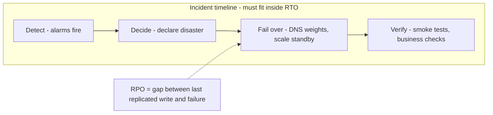
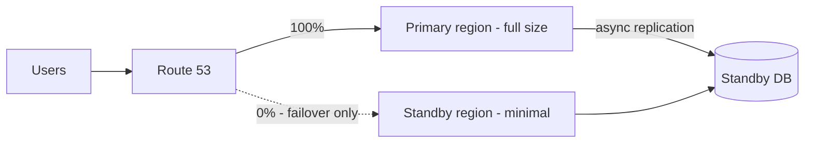
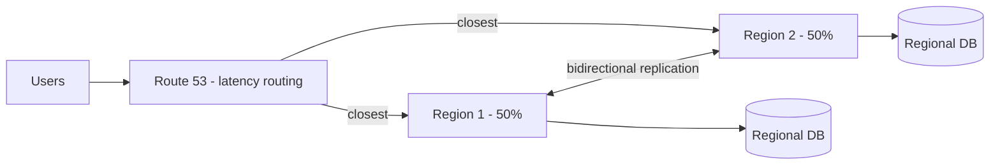

# Disaster Recovery

## Basics: what disaster recovery actually is

Disaster recovery (DR) answers one question: **when a whole failure domain is gone, how do we come back?** Keep it distinct from its cousins:

| Concept | Protects against | Example |
|---|---|---|
| Fault tolerance | Component death, no interruption | Two tasks, one dies, LB reroutes |
| High availability (HA) | AZ/node failure, minimal interruption | Multi-AZ deploy, HPA, health checks |
| Backup | Data loss, human error, corruption | Daily snapshots, versioned buckets |
| Disaster recovery | Region loss, provider outage, total data-plane failure | Traffic + data live on in a second region |

HA keeps you up through the *common* failures. Backups let you rewind the *small* ones. DR is the plan for the *rare, total* ones — and it is the only one of the four that is primarily an **organizational** capability rather than a technical one. The tech is the easy half.

What counts as a "disaster" worth declaring: region-wide cloud impairment, loss of primary data store with no in-region recovery path, or any event where in-region RTO exceeds what the business signed. Define the trigger in advance — debating "is this a disaster?" mid-incident burns the RTO budget on process instead of recovery.

## RTO and RPO, properly

These two numbers are design inputs, not aspirations. Get them from the business in writing, per service tier (payments get different numbers than internal dashboards).

- **RTO (Recovery Time Objective)** — the maximum acceptable downtime. "Checkout can be down at most 15 minutes." Everything in the runbook must fit inside it: detection + decision + failover + verification.
- **RPO (Recovery Point Objective)** — the maximum acceptable data loss, measured in time. "We can afford to lose at most 1 minute of orders." This dictates the replication design: async replication with 30s lag satisfies a 5-minute RPO and fails a 10-second one.

Worked example: RTO 15 min, RPO 1 min for checkout.

- Detection: PagerDuty from regional health alarms, ~2 min.
- Decision: incident commander declares, ~3 min (pre-authorized — see multi-team section).
- Failover: Route 53 weight flip (60s TTL) + standby scale-up, ~5 min.
- Verify: synthetic checkout + order-rate dashboard, ~3 min.
- Total ≈ 13 min < 15 min RTO. ✔
- RPO: synchronous cross-region replication or sub-minute async lag required — backup-restore (hourly snapshots) is disqualified by the 1-minute RPO alone.

The cost curve is brutal and non-linear: 4-hour RTO / 1-hour RPO is snapshots and a runbook (cheap). 15-min RTO / 1-min RPO is warm standby with continuous replication (10x). Near-zero RTO/RPO is active-active with synchronous replication (50x, plus latency tax on every write). **Never design before the numbers exist — you will either overspend 10x or miss the target.**

## The spectrum (cheap → expensive)

| Strategy | RTO | RPO | How |
|---|---|---|---|
| Backup + restore | Hours | Hours (last backup) | Snapshots to another region, restore on disaster |
| Pilot light | Tens of minutes | Minutes | Core data replicated; infra as code spins up the rest |
| Warm standby (active-passive) | Minutes | Seconds–minutes | Scaled-down live copy; scale up + flip DNS on failure |
| Active-active | Seconds–~1 min | ~Zero | Full traffic in 2+ regions; failure just shifts weight |

## What we achieve with this (outcomes per tier)

| Tier | Customer outcome | Business outcome | Engineering outcome |
|---|---|---|---|
| Backup + restore | Long outage, some lost orders | Refunds, SLA credits | Clear restore path, no heroics |
| Pilot light | Degraded ~30-60 min | Contained impact | IaC actually works under pressure |
| Warm standby | Brief blip, tiny data gap | No headline, minor reconciliation | Failover is a rehearsed procedure |
| Active-active | Nothing noticed | Revenue continues | Failure is a weight change, not an event |

The honest pitch to leadership: DR doesn't prevent disasters — it converts **unbounded, improvised outages into bounded, rehearsed ones**. The deliverable is a number (RTO/RPO met in the last game day), not a diagram.

## Active-Passive (warm standby)

One region serves; the second idles at minimal size with replicated data. On failure: scale up, flip DNS, verify.

Pros: half the bill of active-active, simpler data story. Cons: failover is a *procedure* (runbook + humans + 10-30 min), the standby rots if never exercised, and "minimal size" still costs money for idle DB/compute.

## Active-Active

Both regions serve live traffic (latency routing or weighted split). Data replicates both ways (Aurora Global DB, DynamoDB Global Tables). A regional failure is just a weight change — often automatic via health checks.

Pros: RTO in seconds, no cold standby, extra capacity absorbs spikes. Cons: full double bill, conflict resolution on writes (last-writer-wins vs partitioning), every deploy ships to N regions, debugging spans regions.

## Write conflicts: the real active-active tax

Reads scale anywhere; **writes** are the problem. Options, cheapest first:

1. **Single-writer region** — all writes go to one region, reads local everywhere. (Most "active-active" systems are really this.)
2. **Partitioned writes** — a tenant's writes always land in one region (sticky by tenant/geo). No conflicts by construction.
3. **Conflict resolution** — true multi-writer with last-writer-wins or CRDTs. Only for data models designed for it.

If nobody can explain the write story, the design is active-active on slides and active-passive in production.

## Multiple teams: who does what when it burns

DR fails at team boundaries, not technology. A regional failover touches platform, app teams, data, security, support, and leadership — all deciding under time pressure. Pre-assign everything below; the incident is the wrong time to discover ownership.

### Roles (named humans, with backups, reviewed quarterly)

| Role | Owns | Example |
|---|---|---|
| Incident Commander (IC) | Declares disaster, runs the clock, makes call/no-call decisions | Platform lead on-call |
| Ops lead | Executes the failover steps (DNS, scale-up, traffic shift) | DevOps engineer |
| App leads (per service) | Verifies their service post-failover, owns service-specific quirks | Backend owners |
| Data owner | Confirms replication lag within RPO, authorizes write promotion | DBA / data engineer |
| Comms lead | Status page, customer support scripts, leadership updates | Support manager |
| Scribe | Timeline log of every decision (needed for the retro and the audit) | Anyone not executing |

One IC, exactly one. Anyone can *suggest* failover; only the IC *orders* it.

### RACI for the failover decision

| Decision | Responsible | Accountable | Consulted | Informed |
|---|---|---|---|---|
| Declare disaster | IC | VP Eng (pre-authorizes IC below a severity line) | App leads | All teams, leadership |
| Flip DNS / shift traffic | Ops lead | IC | App leads | Comms lead |
| Promote standby DB to writer | Data owner | IC | Ops lead | App leads |
| Fail back to primary | IC | VP Eng | All leads | Customers via status page |

Pre-authorization is the key trick: leadership signs in advance that the IC may order failover when conditions X/Y/Z are met, without a 30-minute approval call that consumes the RTO.

### Communication cadence during the incident

- **War room**: one video link, one chat channel, opened by the IC in the first 5 minutes. No side channels — decisions made outside the room didn't happen.
- **Updates every 15 minutes** to the channel: what we know, what we're doing, ETA to next update. Comms lead translates for status page + support.
- **Team check-ins**: each app team posts red/yellow/green for their service after every failover step. IC never assumes silence means healthy.

### Failback (the forgotten second incident)

Traffic is on standby; primary is repaired. Failback needs its own mini-plan: re-sync data direction (standby→primary lag must be ~zero first), shift a canary slice back, verify, then full shift. Schedule it in business hours with full staffing — never fail back at night to "get it over with." Data loss happens in failback more often than in failover.

### Cross-team game days

Quarterly, business hours, all teams in the room:

1. IC declares a *simulated* regional loss (no real traffic moved, or move 1% canary).
2. Each team executes its runbook section against the clock; scribe times every step.
3. Measure: detection time, decision time, simulated RTO fit, RPO verification from replication-lag dashboards.
4. Retro within 48h, blameless, with action items that have owners and dates. The game day that produces no action items was theater.

New teams/services onboard by *joining* the next game day, not by reading the runbook.

## The unskippable parts (both models)

- **Game days.** Fail over on purpose, quarterly, during business hours (that's when the experts are awake). If failover needs a hero, it will fail at 3 AM.
- **Runbook with a clock.** Each step has an owner *and* an expected duration; total must fit RTO. Time it live.
- **Data restore tested, not assumed.** A backup you never restored is a rumor. Restore to a scratch account monthly.
- **DNS TTLs set *before* the incident** (see the Route 53 guide) — 5-minute TTLs decided during an outage help nobody for 5 minutes... or for cached clients, hours.

## Rule of thumb

**Get RTO/RPO signed in money terms first. Buy active-passive unless the signature says otherwise. Name one IC, pre-authorize the failover decision, rehearse quarterly with every team in the room — and never fail back at night.**
