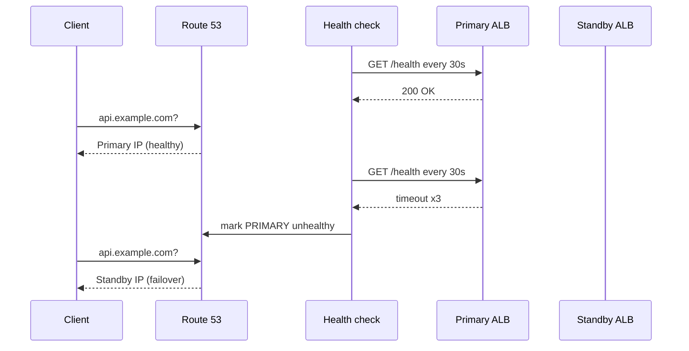
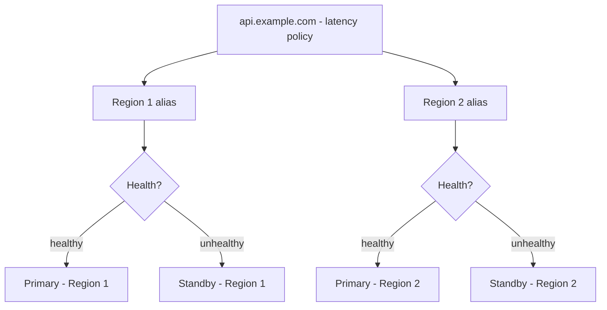

# DNS Failover with Route 53

DNS is the cheapest global load balancer you already own. Route 53 combines **health checks** (is it alive?) with **routing policies** (who gets traffic?) — and failover is just a routing policy driven by health.

## How a failover record works

Key detail: Route 53 health checks run **from outside your VPC** (global checkers). They see what users see — which is exactly what you want for failover, and exactly why the endpoint must be public or use CloudWatch-alarm-based checks for private resources.

## Health check design

- **Check the ALB endpoint, not a single task.** The ALB already aggregates task health; DNS failover should react to regional/service-level death, not one bad pod.
- **String matching beats status codes.** Require a body string (e.g. `ok`) so a misconfigured proxy returning `200` with an error page doesn't count as healthy.
- **Alarm-based checks for private things.** Can't expose it? Publish a CloudWatch alarm (e.g. healthy-host-count < threshold) and let Route 53 watch the alarm via `CloudWatchAlarm` health check type.
- **Intervals and thresholds are RTO knobs.** 30s interval × 3 failures ≈ 90s detection. Faster (10s) exists — spend it only where RTO demands it, since each check is metered per endpoint.

## Routing policies cheat-sheet

| Policy | Behavior | Use for |
|---|---|---|
| Simple | One answer | Non-critical, single region |
| Failover | Primary + standby, flip on health | Active-passive DR |
| Weighted | X% / Y% split | Blue-green, canary across regions, migration |
| Latency-based | Closest healthy region | Active-active serving |
| Geolocation / Geoproximity | Answers by user location | Compliance, localization, traffic shaping |
| Multivalue | Up to 8 healthy answers, client picks | Cheap client-side balancing |

Combine them: latency-based *within* healthy regions + failover *between* tiers. Route 53 policies nest via record hierarchy.

## TTL: the knob everyone sets once and regrets

- **Low TTL (60s)** — failover propagates in ~a minute. Cost: every client re-resolves constantly (higher query bill, slightly more latency).
- **High TTL (3600s+)** — cheap and fast for clients, but failover takes *up to the TTL* to reach cached resolvers. Some ISPs and clients ignore low TTLs anyway.
- Rule: **set the TTL for the failure case, not the happy case.** Failover records get 60s; static records can keep 300-3600s. Decide before the incident — changing TTL mid-outage only helps after the old TTL expires.

## Failover + deploys (the subtle interaction)

Blue-green across regions via weighted records: shift 100 → 90/10 → 50/50 → 0/100, watching canary metrics between steps. Keep the old stack until DNS fully converges (TTL × 2, minimum), because *some* clients will hold the old answer. Premature teardown of the old stack is the classic self-inflicted post-deploy outage.

## Active-active DNS in one paragraph

Latency-based routing to two healthy regions, each with its own failover standby, health checks on regional ALBs, 60s TTLs, single-writer DB with global reads (see DR guide). That paragraph is a production multi-region design; everything else is sizing.

## Rule of thumb

**Health-check the ALB with string matching, fail over on latency policy for active-active or failover policy for active-passive, TTL 60s on anything that moves traffic — and never tear down the old stack before TTL×2.**
