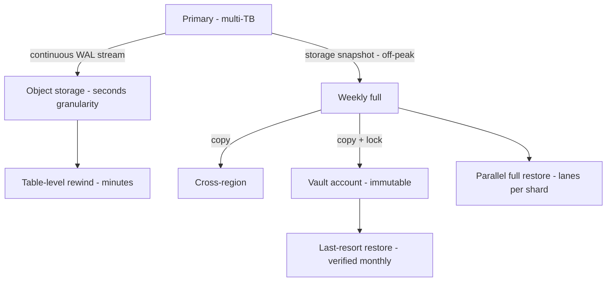

# Database Backup Strategy: Basics to Architect

## Level 1 — Basics: why we take backups at all

Replication keeps you running; **backups let you go back in time**. They solve different problems:

| Problem | Fix | Example |
|---|---|---|
| Server/AZ dies | Replication + failover (HA) | Aurora replica promotes |
| "Oops" delete / bad deploy corrupts data | Backup restore / point-in-time recovery | Restore table to 10 min ago |
| Ransomware / attacker wipes everything including replicas | Isolated, immutable backup | Cross-account vault copy |
| Region gone / compliance audit / legal hold | Off-site, long-retention archive | Monthly snapshot, 7-year retention |
| "What did the data look like last quarter?" | Archived snapshot | Analytics on historical copy |

The one-liner: **replication protects against hardware; backups protect against everything else — especially us.** Most data loss is human (bad migration, wrong WHERE clause, dropped table), not hardware.

A backup you never restored is a rumor. Every strategy below is worthless without scheduled restore tests.

## Level 2 — Production practitioner

### Full, incremental, differential

- **Full** — entire DB copy. Slowest, biggest, simplest to restore (one artifact). Weekly/monthly base.
- **Incremental** — changes since *last backup of any kind*. Smallest, fastest; restore needs full + every incremental in chain. Hourly/daily.
- **Differential** — changes since *last full*. Middle ground; restore needs full + latest differential. Daily.

Chains are risk: one corrupt incremental breaks the whole chain. Keep chains short (a fresh full weekly caps the blast radius).

### Why daily / weekly / monthly / hourly — the GFS rotation

Grandfather-Father-Son: different frequencies serve different RPOs and retention needs, not tradition:

| Frequency | Why it exists | Retain | Restores |
|---|---|---|---|
| Hourly (incremental / WAL) | Tight RPO — lose at most ~1h of writes | 24-48h, then roll up | "Undo the last hour" (bad deploy, oops-delete) |
| Daily (full or differential) | Standard RPO — lose at most a day; the workhorse restore point | 7-30 days | "Yesterday was fine" — most common real restore |
| Weekly (full) | Clean, tested base for chains; bounds incremental-chain length | 4-12 weeks | Weekly verification restores, medium-age requests |
| Monthly (full, archived) | Compliance, legal hold, audits, long-tail investigations | 12 months – 7+ years | "Show me Q1 data," regulators, lawsuits |

The retention pyramid: many short-lived copies (cheap, fast restore of recent pain) narrowing to few long-lived copies (compliance). Storage cost concentrates at the top; restore frequency concentrates at the bottom.

### The mechanics that matter (RDS/Aurora-flavored)

- **Automated snapshots + transaction logs = point-in-time recovery.** Nightly snapshot plus continuous WAL archiving means "restore to any second in the retention window" — this single feature covers 90% of oops-scenarios. Set retention 7-35 days deliberately, not by default.
- **Manual snapshots before risky changes.** Migration, major deploy, bulk delete: snapshot first, name it, note the timestamp in the change ticket. Costs pennies, saves careers.
- **Cross-region copy.** A backup in the same region dies with the region. Copy automated snapshots to the DR region on a schedule matching RPO.
- **Encryption everywhere** (KMS, CMKs per environment) + **locked-down restore permissions**. Backups are a data-exfiltration path — whoever can restore can read everything.
- **Restore drill monthly.** Automated: restore latest snapshot to a scratch instance, run row-count + checksum queries, alert on mismatch, delete. If the drill isn't automated, it won't happen.

## Level 3 — Architect: backups at millions-scale

At terabytes and millions of writes/min, "nightly full backup" becomes a performance event and "restore" becomes a project:

- **Snapshot windows are load.** Full snapshots on multi-TB primaries steal IOPS and bloat storage. Use storage-level snapshots (EBS/RDS: copy-on-write, near-instant, no DB load), stagger windows across shards/cells, and never let backup windows overlap peak traffic.
- **Continuous backup over batch.** Aurora Backtrack (rewind without restore), DynamoDB PITR (per-second granularity, 35 days), WAL streaming to object storage — at scale you stop thinking "backup jobs" and start thinking "always-on change capture." RPO drops to seconds as a side effect.
- **Parallel, partitioned restore.** Restoring one 10TB blob serially misses every RTO. Sharded/cell-partitioned data restores in parallel lanes; table-level restore (DynamoDB, Aurora) recovers one table without touching the rest. Design the partition key with restore parallelism in mind.
- **Cross-account, immutable vault.** Ransomware encrypts everything your credentials can touch — including same-account backups. Copies go to a locked-down second account (separate KMS, Object Lock / vault policies, no delete permission for daily roles). Test restore *from the vault*, not just to it.
- **Compliance retention as lifecycle policy.** 7-year monthly archives in cheap tiers (S3 Glacier-class) with legal-hold tags, lifecycle transitions automated, deletion only by policy + dual approval. Auditors ask for proof of process, not just data.
- **Backup integrity at scale.** Checksums per artifact, automated sample restores with data validation (counts, hashes, app-level smoke queries), backup-monitoring dashboards (age of last good backup per DB — alert when stale). A silent backup failure discovered during an incident is the incident.
- **Cost control.** Snapshot sprawl is real money at TB scale: lifecycle-expire manual snapshots (tag with TTL at creation), deduplicate overlapping jobs (automated + manual + pipeline-triggered), tier cold archives down. Review the backup bill quarterly like any other infra bill.

## Rule of thumb

**Basics: replication is not backup — humans are the main threat model. Production: GFS rotation matched to RPO (hourly/daily/weekly/monthly), PITR on, cross-region copies, encrypted, restore-drilled monthly. Millions: continuous capture over batch jobs, parallel restores per shard, immutable cross-account vault, integrity dashboards — and the only backup that counts is the last one you successfully restored.**
