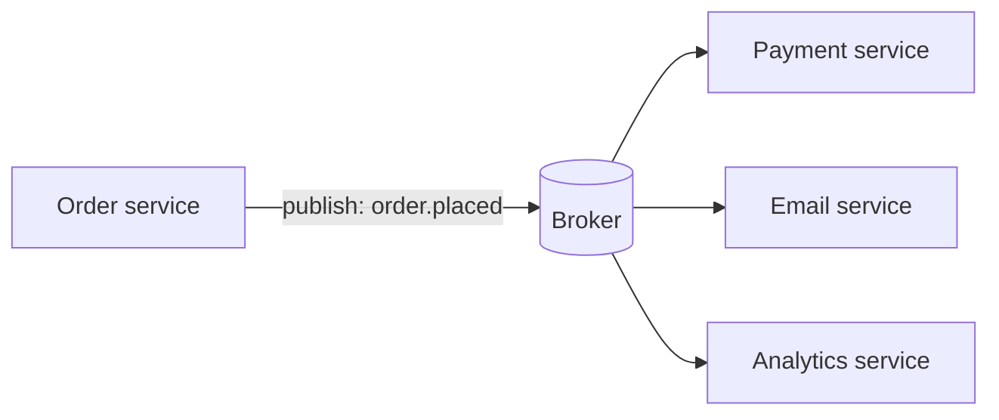
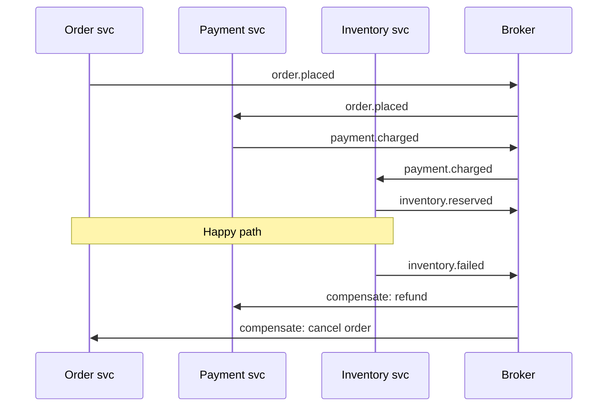
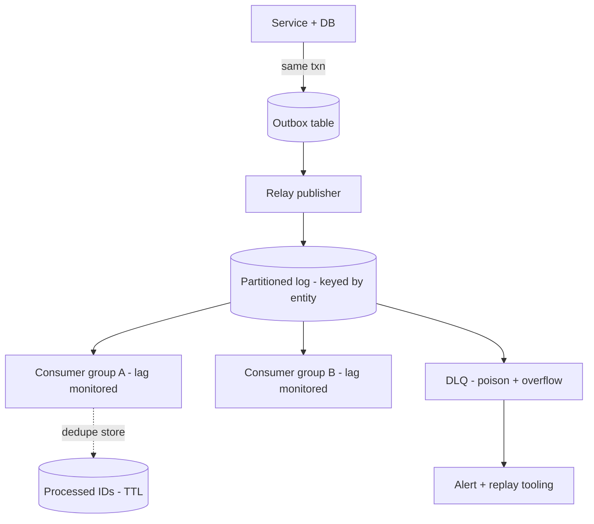

# Event-Driven Architecture: Basics to Architect

## Level 1 — Basics

In a normal request flow, Service A calls Service B and waits. A is now **coupled** to B: if B is slow, A is slow; if B is down, A fails. Event-driven architecture breaks this: A publishes an **event** ("order placed") to a **broker** and moves on. Interested services consume it at their own pace. Nobody waits for anybody.

Core vocabulary: **event** (immutable fact about something that happened), **broker** (durable pipe: Kafka, SQS, EventBridge), **producer/consumer**, **topic/queue**. The event already happened — consumers can't change the past, only react to it.

## Level 2 — Production practitioner

### Picking the pipe

| Tool | Model | Use when |
|---|---|---|
| SQS + SNS | Queues + fan-out, managed | Simple decoupling, retries + DLQ built in |
| EventBridge | Event bus + rules | AWS-service events, SaaS webhooks, content-based routing |
| Kafka / MSK | Partitioned log, replayable | High throughput, ordering per key, stream processing |
| RabbitMQ | Flexible routing, low latency | Complex routing topologies, classic messaging |

Default to managed (SQS/EventBridge) until throughput or replay needs force Kafka. Running ZooKeeper/KRaft at 3 AM is a rite of passage you can skip.

### The five non-negotiables

1. **Idempotent consumers.** Brokers deliver *at-least-once*: the same event arrives twice (retries, rebalances). Consumers must handle duplicates — dedupe keys, upserts, "processed event IDs" table. If your handler isn't idempotent, it's broken; you just haven't seen the duplicate yet.
2. **Dead-letter queues.** After N failed attempts, park the message in a DLQ with headers (failure reason, retry count) and alert. A poison message without a DLQ blocks the whole partition behind it.
3. **Schema + versioning.** Events are a public API. Schema registry (or versioned event types like `order.placed.v2`), additive changes only, consumers tolerate unknown fields. A producer renaming a field is a cross-team breaking change.
4. **Ordering where it matters, nowhere else.** Global ordering doesn't scale — order *per key* (Kafka partition key = order ID; FIFO queue group ID). Design so most events don't need ordering at all.
5. **Correlation IDs.** One ID flows through every event from the original request. Without it, debugging across five async services is archaeology.

### Saga: distributed transactions without distributed transactions

No 2PC across services. Instead: each step publishes an event; next service acts; on failure, publish **compensating events** (refund, cancel, restock) that undo prior steps. Choreography (services react independently) is simple; orchestration (a saga controller drives steps) is debuggable. Start choreographed, add an orchestrator when the flow has >4 steps or auditors ask "who is in charge here?"

## Level 3 — Architect: events at millions-scale

At millions of events/min across dozens of teams, the broker is the nervous system — and every shortcut becomes systemic:

- **Outbox pattern for atomic publish.** Writing to the DB *and* publishing is two actions that can split (crash between = lost event or ghost event). Write the event to an outbox table in the *same DB transaction*, let a relay publish it. No dual-write, no ghosts. Non-negotiable for money-path events.
- **Partitioning strategy is the scaling strategy.** Throughput scales with partitions; ordering lives within a partition. Key by the entity that must stay ordered (order ID, tenant ID) — and watch for hot partitions (one celebrity tenant = one screaming partition; split by sub-key or accept the skew with headroom).
- **Exactly-once is a myth; idempotence is the reality.** Kafka transactions + idempotent producers narrow the window but consumer-side dedupe is still required end-to-end. Budget a dedupe store (TTL'd, sized for retention window) and move on.
- **Event retention as a feature.** Kafka-style replayable logs turn incidents into replays: rewind consumers, reprocess after a bugfix, bootstrap new services from history. Size retention for the business (7 days minimum; 30+ if replays are routine) and cost it like storage, because it is.
- **Backpressure across the mesh.** A slow consumer must not kill the broker or the producer: bounded consumer lag with alerts, per-consumer quotas, spillover to DLQ/parking topics, producer throttling. At scale every queue needs a "full" policy decided in advance — unbounded growth is just a delayed outage with interest.
- **Schema governance across teams.** Central registry, compatibility checks in CI (breaking change = failed build, not a Slack argument), event catalog with owners. Dozens of producers without governance produce a data swamp with extra steps.
- **Multi-region events.** Replicate topics cross-region (MirrorMaker-style) for DR, but decide ordering semantics per region (single active writer region per aggregate avoids cross-region conflicts — same lesson as active-active DBs). Consumers must handle region-failover replays = more duplicates = idempotence again.
- **Observability of flows, not just services.** Trace per event-type: publish rate, consumer lag per group, DLQ depth/age, end-to-end latency from publish to final consumer. Alert on *lag growth rate*, not absolute lag — a steady 10k backlog is fine; a backlog doubling every 5 min is fire.

## Rule of thumb

**Basics: publish facts, never wait. Production: idempotent handlers, DLQs, versioned schemas, order per key, correlate everything. Millions: outbox every money event, partition by ordered entity, dedupe at the consumer, retain for replays, govern schemas in CI — the broker is critical infrastructure, so operate the lag, the DLQ, and the duplicates like production metrics, because they are.**
