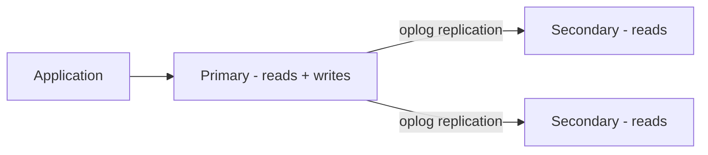
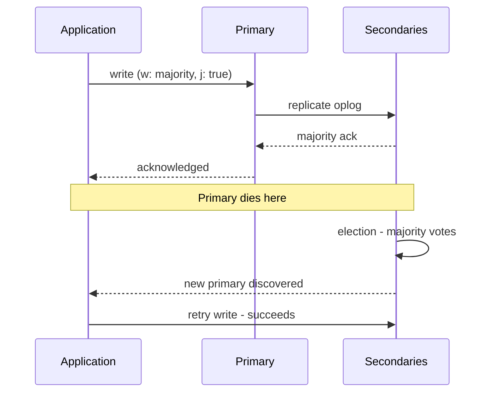
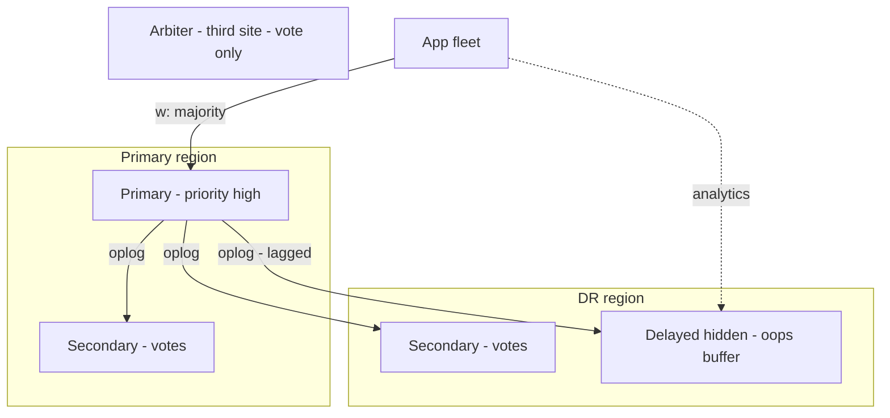

# Replica Set Architecture: Basics to Architect

## Level 1 — Basics

One database server is a single point of failure. A **replica set** keeps identical copies of the data on multiple servers: one **primary** takes all writes, **secondaries** replicate from it and can serve reads. If the primary dies, the survivors **elect** a new one. The application reconnects and continues — minutes of drama, not hours of restore.

Core vocabulary: **primary/secondary**, **election** (vote for a new primary), **oplog** (ordered log of writes that secondaries replay), **majority** (more than half of voting members — the magic number behind everything below).

## Level 2 — Production practitioner

### How failover actually works

1. Heartbeats (default every 2s) detect the primary is unreachable.
2. Secondaries call an election; a candidate wins only with **majority votes**.
3. Winner promotes, starts accepting writes; drivers discover the new topology and reroute.
4. Old primary, if alive but partitioned, steps down (it can't reach majority either) — this is what prevents split-brain.

Typical unattended failover: 10-30s. Your app must **retry once** on topology change (retryable writes / retry reads) instead of surfacing the blip to users.

### Members beyond the basics

| Member | Votes? | Data? | Use for |
|---|---|---|---|
| Secondary | Yes | Yes | Read scaling, failover candidates |
| Arbiter | Yes | No | Cheap majority vote (no data copy) |
| Hidden | No | Yes | Backups, analytics without stealing votes or read traffic |
| Delayed | No | Yes (lagged) | Oops-undo: 1-2h behind, rewinds human errors |

Rules: odd number of **voting** members (3 or 5 — majority math breaks ties cleanly), never an even split across two sites without an arbiter third site, hidden/delayed members don't vote so they can't tip elections.

### Write and read concerns (the knobs that matter)

- **Write concern `majority` + journaling** — a write returns only after most members durably have it. Survives a primary death without rollback. Slower than `w:1`, correct instead of fast.
- **Read concern `majority`** — reads don't return data that could roll back. Pair with majority writes for real consistency.
- **Read preference** — `primary` (strongest consistency), `secondaryPreferred` (offload reads, tolerate slight staleness), `nearest` (lowest latency, any staleness). Analytics → hidden secondary; user-facing fresh reads → primary.

### Oplog sizing

The oplog is a capped window: if a secondary falls behind beyond the window, it needs a full resync. Size the oplog for **maintenance + outage windows** (24-72h of writes minimum) — the #1 cause of "secondary fell off, full resync during peak" incidents is a default-sized oplog meeting a long weekend.

## Level 3 — Architect: replica sets at millions-scale

### Multi-region sets

Spread voting members across regions for regional survival: e.g. 3 votes in primary region + 2 in DR region. Writes stay fast (majority achievable locally); a region loss still elects. Priority/weights keep the primary where the app is (no cross-region write latency in steady state). Never split votes evenly across two regions without a third-site arbiter — a link cut leaves *both* sides voteless.

### Elections at scale hurt — design around them

- **Connection storms.** Every driver reconnects + re-discovers simultaneously; thousands of app hosts × reconnection = login/auth thundering herd. Stagger client timeouts, keep connection pools warm, and load-test the election path, not just steady state.
- **Retry budgets.** Retryable writes save users during the 10-30s window — but unbounded retries amplify. One retry, backoff with jitter, then fail fast to a degraded path.
- **Rollback risk.** Writes acknowledged with `w:1` on a dead primary may roll back when it rejoins as secondary. At millions of writes/min, "may roll back" is guaranteed data loss somewhere. Majority journaled writes eliminate the class, not the instance.

### Initial sync and resync of TB-scale members

Full sync copies everything — on multi-TB sets that's hours of network + disk load on the donor. Seed from filesystem snapshots (faster than logical copy), sync new members off-peak, and keep one spare in-sync hidden member during risky windows so resync is never the only option.

### Replica sets vs sharding (know the boundary)

A replica set scales **availability**, not write throughput — every member replays every write. When a single primary's write capacity or working set outgrows hardware: **shard** (each shard is itself a replica set). Sharding buys write scale at the cost of cross-shard queries/transactions; don't pay it before vertical + replica-set tuning is exhausted. The architect's call is *when*, measured in primary CPU/IO saturation curves, not vibes.

### Monitoring that predicts elections

Alert on derivatives, not states: replication lag *growth*, oplog window *shrink rate*, election *count* (any election outside game day is an incident), rollback *bytes* (any nonzero is a Sev). A dashboard of current primary is trivia; a dashboard of lag velocity is foresight.

## Rule of thumb

**Basics: one writer, voters elect, majority prevents split-brain. Production: odd voters, majority journaled writes, reads by freshness need, oplog sized for the long weekend, retry once. Millions: votes across regions with local majority, drill the election storm, seed TB members from snapshots, shard only when the primary's saturation curve says so — and alert on lag velocity, because elections announce themselves before they happen.**
