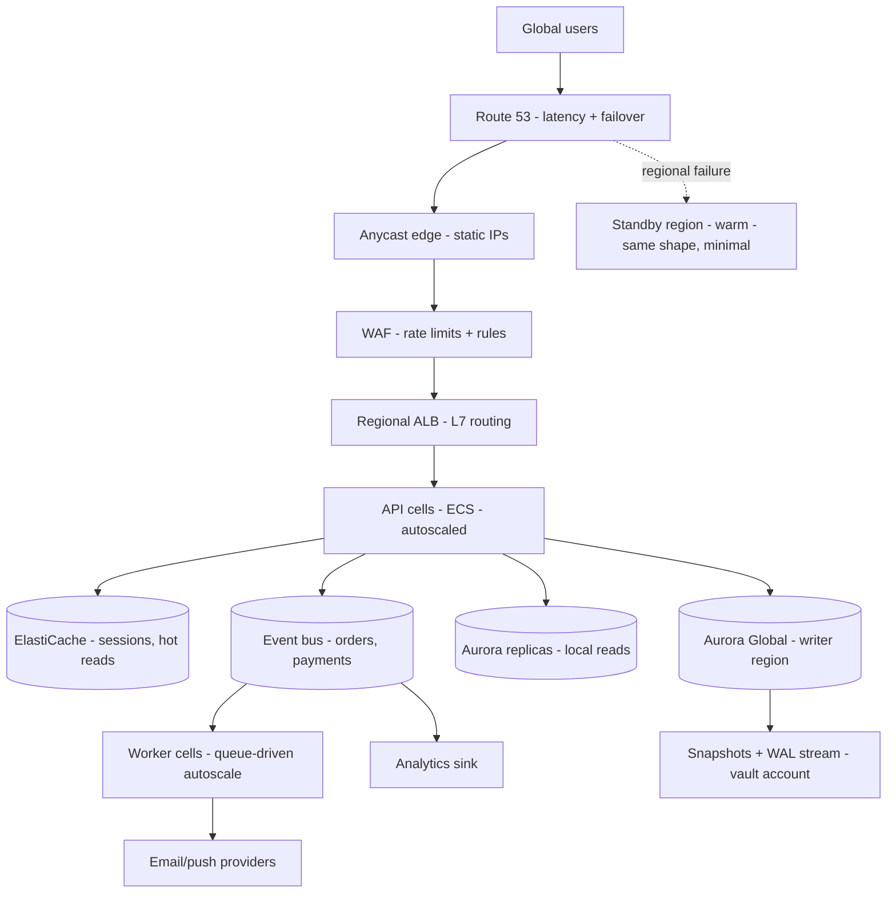
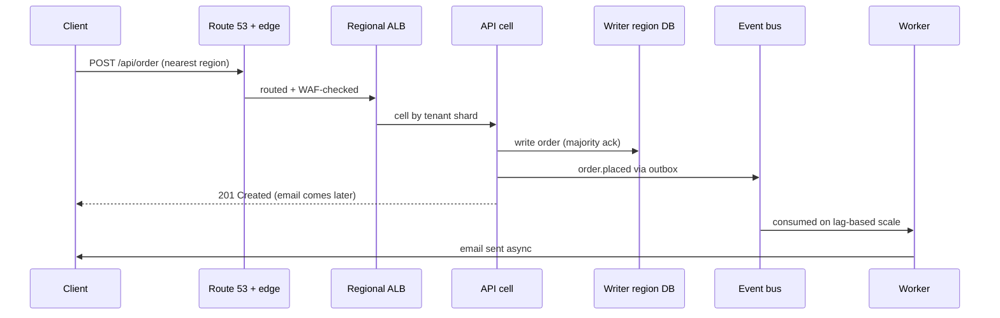

# Full Application Architecture: Everything Combined

This is the capstone: one production system that uses **all nine guides at once**, serving millions of requests across regions. Read it as the answer to "draw me a system that won't embarrass us." Each layer links back to its deep-dive.

The example: a global coupon/commerce platform — spiky traffic (flash sales), money-path writes (orders, payments), heavy reads (catalog, coupons), background work (emails, analytics). If your domain differs, swap the nouns; the shape holds.

## The whole thing, one diagram

## Layer by layer (which guide, why)

### 1. Edge + DNS ([Load Balancers](01-load-balancers.md), [Route 53](06-dns-failover-route53.md))

Anycast edge with static IPs fronts everything (partner firewalls, mobile clients pin IPs). WAF sheds floods at the edge. Route 53 latency-routes to the nearest healthy region with 60s TTLs and automatic failover. **Why:** global reach, cheap shedding, seconds-scale regional evacuation.

### 2. Regional entry ([Load Balancers](01-load-balancers.md), [AZs](04-availability-zones.md))

Per region: ALB across 3 AZs, path-based routing (`/api/*`, `/static/*`), honest `/health` checks, 30s draining, slow-start on fresh targets. NAT per AZ, tasks balanced per AZ with N-1 headroom. **Why:** AZ events become non-events; deploys never drop connections.

### 3. Compute cells ([AZs](04-availability-zones.md), [Auto Scaling](03-auto-scaling.md), [Deployments](02-deployment-strategies.md))

API runs in **cells** — isolated slices by tenant shard, each independently deployable and autoscaled on requests-per-target with warm pools. Rollouts go cell-by-cell with bake time; feature flags decouple shipping from release. Flash sales are pre-scaled from forecast; the reactive loop handles only the delta. **Why:** a bad build or hot tenant burns one cell; capacity exists before the spike, not during it.

### 4. Data: reads local, writes single ([Replica Sets](09-replica-set-architecture.md), [DR](05-disaster-recovery.md))

Aurora Global: one writer region, read replicas everywhere. App reads go local; all writes go to the writer region (single-writer — no conflict tax). Odd-voter replica sets per region, majority journaled writes, oplog/WAL windows sized for weekends. **Why:** global reads at local latency, zero write conflicts, regional DB death is a replica promotion, not data loss.

### 5. Async backbone ([Event-Driven](08-event-driven-architecture.md))

Order/payment events hit the bus via the **outbox pattern** (same transaction as the DB write). Worker cells scale on per-consumer queue lag. Consumers idempotent with dedupe stores; poison flows to DLQs with alerts and replay tooling. Retention sized for incident replays. **Why:** checkout never waits for email/analytics; workers absorb 10x bursts as lag, not errors.

### 6. Safety nets ([Backups](07-database-backups.md), [DR](05-disaster-recovery.md))

Continuous WAL stream + weekly fulls + GFS rotation, cross-region copies, immutable vault account, automated monthly restore drills. Warm-standby second region (same shape, minimal size) with quarterly failover game days involving every team. **Why:** human error rewinds in minutes; regional death is a rehearsed weight flip; ransomware meets a vault it can't touch.

## A request's life (the golden path)

Notice what the client *doesn't* wait for: email, analytics, or anything beyond the durable write. Latency is a architecture choice, and this one spends it only on correctness.

## A failure's life (the week everything breaks)

| Failure | What happens | Who notices |
|---|---|---|
| One task dies | LB drains, replacement starts, p99 flat | Nobody (dashboard flicker) |
| Whole AZ lost | Cells evacuate, N-1 absorbs, zonal shift | On-call (page), users (nothing) |
| Bad deploy in cell 1 | Auto-halt on SLO breach, flag off, 1 cell affected | Deploy owner (auto-rollback) |
| Writer region impaired | Route 53 flips, standby promotes, workers replay | IC declares, all teams verify |
| Oops-delete of coupon table | Table-level rewind to 10 min ago | App team (restore drill muscle memory) |
| 10x flash-sale spike | Pre-scaled base holds, loop adds, edge sheds excess | FinOps (bill) + nobody else |

## What it costs (honest version)

Active-passive + cells + continuous backup ≈ 1.6-2x a naive single-region bill: double data copies, N-1 headroom, warm standby, WAF, log retention. What that buys: bounded incidents (minutes, rehearsed) instead of unbounded ones (hours, improvised). Present it as insurance with a measured premium — and keep trimming the 10% waste, because at millions of requests waste is headcount.

## Build order (if starting today)

1. Single region, multi-AZ, honest health checks + draining (guides 01, 04).
2. IaC + rolling deploys with auto-rollback (guide 02) via the gated pipeline.
3. Autoscaling on the right signal + pre-scale calendar (guide 03).
4. PITR + GFS backups + restore drills (guide 07).
5. Events for the slow paths with outbox + DLQ (guide 08).
6. Cells for blast radius (guide 04), then warm standby + game days (guide 05), then latency DNS (guide 06).

Each step is independently shippable and independently valuable — never a big-bang rewrite.

## Rule of thumb

**Edge sheds, DNS steers, cells contain, single-writer avoids conflicts, events decouple time, backups rewind humans, game days prove all of it. Architect the request path for latency, the failure paths for bounded blast radius — and build it in six shippable steps, not one heroic rewrite.**
