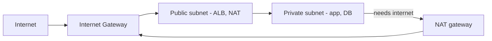
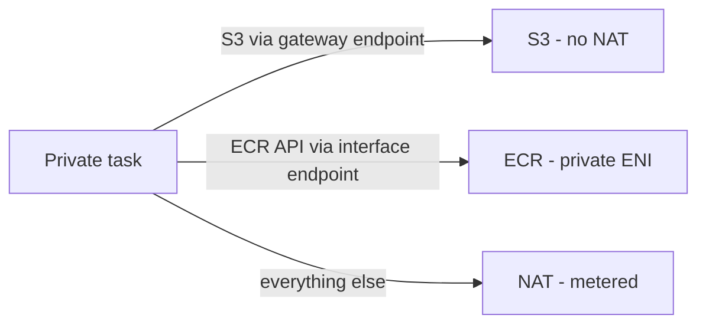
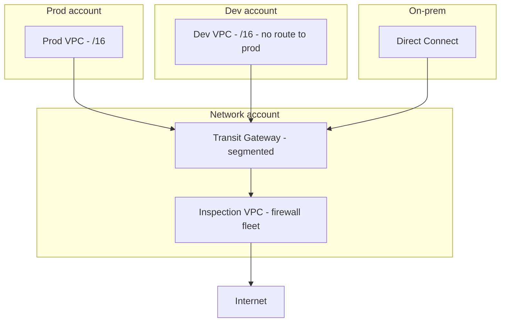

# AWS Networking: How It Works, Basics to Architect

## Level 1 — Basics

Every AWS workload lives in a **VPC** — your private network slice in a region. Inside it: **subnets** (IP ranges tied to one AZ), **route tables** (where traffic goes), an **Internet Gateway** (door to the internet), and two firewalls: **Security Groups** (per-resource, stateful) and **NACLs** (per-subnet, stateless).

The golden rule: **public subnets hold only things that must face the internet (load balancers); everything else lives private and reaches out through NAT.** If your database has a public IP, the design is wrong.

## Level 2 — Production practitioner

### Subnets, routes, and the packet's journey

- **Public subnet:** route `0.0.0.0/0 → IGW`. Resources can have public IPs and talk both ways.
- **Private subnet:** route `0.0.0.0/0 → NAT`. Resources initiate outbound (patches, APIs) but nobody can initiate inbound.
- **Isolated subnet:** no route out at all. Databases that only talk to app-tier neighbors. Strongest posture, least convenience.

An inbound request: Internet → IGW → public route table → ALB → ALB's security group allows 443 → target in private subnet (private route table, SG allows from ALB SG only) → response returns via the same path (security groups are stateful — return traffic auto-allowed).

### Security Groups vs NACLs (stop confusing them)

| | Security Group | NACL |
|---|---|---|
| Attached to | ENI (instance/task) | Subnet |
| Stateful? | Yes (return auto-allowed) | No (explicit both directions) |
| Rules | Allow only | Allow + deny |
| Use for | Everyday filtering, reference other SGs | Coarse guardrails, explicit deny of bad actors |

Practice: SGs reference **other SGs, not IPs** (`app-sg` allows 5432 from `api-sg`, never from `10.0.4.17`). NACLs stay default-allow except targeted denies. If you're writing long NACL rule lists, you're doing SGs' job twice.

### Private access to AWS services (endpoints)

Traffic to S3/DynamoDB/ECR from private subnets shouldn't hairpin through NAT (cost + exposure). **Gateway endpoints** (S3, DynamoDB: free, route-table entries) and **Interface endpoints** (most services: ENIs in your subnets, PrivateLink-powered, ~hourly + per-GB) keep AWS traffic on the AWS backbone.

### Connecting VPCs and the office

- **Peering** — 1:1, non-transitive, fine for two VPCs. Doesn't scale (mesh of peerings = pain).
- **Transit Gateway** — hub-and-spoke for many VPCs/accounts, with route tables per segment (prod can't reach dev). The default once you pass ~4 VPCs.
- **PrivateLink** — expose *your* service to other VPCs/accounts as an endpoint, no peering, no overlapping-CIDR fights. Also how SaaS vendors land privately in your VPC.
- **VPN vs Direct Connect** — VPN for quick/elastic office links over internet; DX for steady, high-throughput, SLA-backed hybrid (plus consistent latency for replication traffic).

## Level 3 — Architect: networking at organizational scale

### Multi-account landing zone

One account per workload/environment (blast radius + billing clarity), networked through a shared **network account** hosting Transit Gateway. Organizations SCPs forbid IGWs in data accounts; all egress funnels through inspected inspection VPCs. Account vending (Control Tower-style) stamps out identical VPC baselines — snowflake networking is how you get overlapping CIDRs and 2 AM peering mysteries.

### IP exhaustion is a capacity plan

VPC CIDRs can't resize upward painlessly, and secondary CIDRs complicate routing. Size once, generously: `/16` per VPC, `/20`-ish per subnet tier per AZ, and **never reuse ranges across VPCs you might peer**. Track allocation centrally — the "we're out of IPs in prod" incident always arrives during a scaling event. IPv6 for pod-dense Kubernetes (pod IPs burn v4 fast); dual-stack where supported.

### Egress architecture (inspection vs cost)

Three postures, pick deliberately:

1. **Direct NAT per AZ** — cheapest, fastest, zero inspection. Fine for most app traffic.
2. **Centralized inspection VPC** (TGW → firewall fleet → NAT) — every byte scanned (TLS-intercepting firewalls, DLP). Costs latency + firewall bill + a new blast radius; justified for regulated data, not for cat pictures.
3. **Hybrid** — sensitive tiers via inspection, bulk tiers direct. Most mature orgs land here.

### DNS as infrastructure (Route 53 private zones)

Private hosted zones per VPC (or shared via RAM), split-horizon names (`db.internal` resolves privately inside, publicly outside), Resolver rules forwarding corp domains over DX/VPN. Hybrid DNS that "mostly works" produces the worst incidents — resolution fails intermittently by location. Design it once, monitor query logs.

### Observability: VPC Flow Logs + Reachability

Flow Logs to S3 (sampled at scale — full capture on TB-scale VPCs is a second data problem), Athena queries for "who talked to whom during the incident," Reachability Analyzer to prove path intent before incidents. When someone says "the network is dropping packets," flow logs end the debate in minutes.

## Rule of thumb

**Basics: public LB, private everything, NAT out. Production: SGs reference SGs, endpoints beat NAT for AWS traffic, TGW past a handful of VPCs. Millions/org-scale: one CIDR plan to rule them out of exhaustion, inspect deliberately not by default, private DNS designed once, flow logs always on — the network is the one dependency every service shares, so give it fewer surprises than anything else.**
