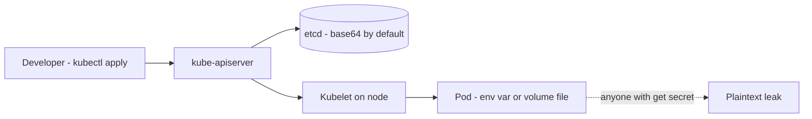
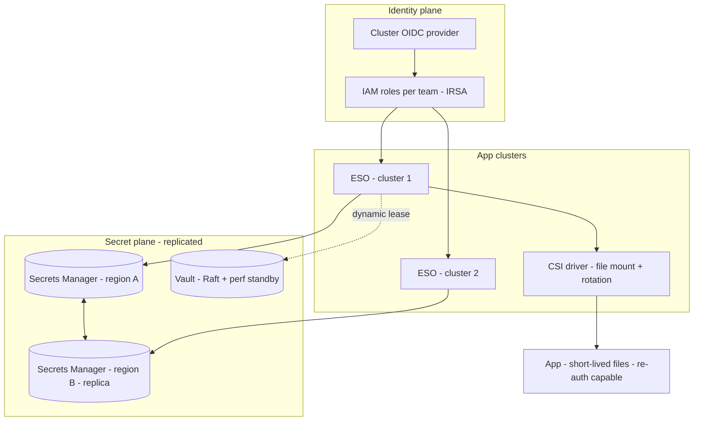

# Kubernetes Secret Management: Basics to Architect

## Level 1 — Basics

A `Secret` is just a namespaced object that holds sensitive bytes (passwords, API keys, TLS certs) separately from images and `ConfigMaps`. Pods consume it as **env vars** or **mounted files**. That's it.

Two lies to unlearn early:

1. **Base64 is not encryption.** `kubectl get secret -o yaml` returns base64 you can decode in your head. Anyone with `get` on the Secret or read access to etcd/backups has the plaintext.
2. **Secrets are cluster-scoped plaintext by default.** Unencrypted etcd + broad RBAC + secrets checked into git = your "secret" is a ConfigMap with guilt.

Core vocabulary: **Secret** (the bytes), **ServiceAccount** (pod identity), **RBAC** (who can `get` it), **etcd** (where it really lives). If you don't know where etcd backups go, you don't know where your secrets go.

## Level 2 — Production practitioner

### Why raw Secrets fail in prod

- **Git contains secrets.** Copy-pasted YAML with real values lives forever in history.
- **etcd unencrypted.** Snapshot, backup, or managed-control-plane log exposes everything.
- **RBAC too wide.** `cluster-admin for debugging`, CI service accounts, and Helm that reads all Secrets.
- **No rotation story.** Value changes → pods keep stale env until restart. Someone restarts prod by hand at 2 AM.
- **No audit.** Who read `prod/db-password` last month? No idea.

### Picking the pipe

| Tool | How it stores truth | Use when |
|---|---|---|
| Native Secret + KMS encryption at rest | etcd (envelope-encrypted via KMS) | Single cluster, small team, low churn |
| Sealed Secrets | Git holds encrypted blob, controller decrypts in-cluster | GitOps wanted, no external manager yet |
| External Secrets Operator (ESO) + AWS Secrets Manager / Vault | Git holds `ExternalSecret` reference, ESO syncs real value | **Default for prod** — rotation, audit, IAM outside git |
| Secrets Store CSI Driver | Mounts external secret as volume, no etcd copy | High-security, want no etcd copy + rotation without restart |
| Vault Agent Injector / dynamic secrets | Short-lived leases injected as sidecar/files | DB creds that must expire in minutes |

Default to **ESO + external manager (AWS Secrets Manager / Vault) + workload identity (IRSA / Workload Identity)**. Git never holds a value, only a reference. Everything else is a special case.

### The production checklist

- **Encrypt etcd.** Managed (EKS encryption with KMS CMK) or `EncryptionConfiguration` with KMS provider. Separate CMK per environment. If you can't name the key, it's not encrypted.
- **Workload identity, never static cloud keys.** Pod assumes IAM role via ServiceAccount (IRSA). No `AWS_SECRET_ACCESS_KEY` inside a Secret — that's a secret to get secrets.
- **RBAC least privilege per namespace.** App ServiceAccount gets `get` on *its* 2-3 Secrets only. Humans get none in prod (break-glass role with MFA + audit). CI can deploy `ExternalSecret`, never read values.
- **Mount as files, not env.** Env leaks in `kubectl describe pod`, crash dumps, APM, child processes. Volumes can be `readOnly`, `memory-backed`, and rotated without process semantics confusion.
- **Solve rotation + reload together.** External rotation is useless if the app caches the old value. Options: Reloader (rolling restart on change), CSI driver rotation (kubelet rewrites files), or app watches files/SIGHUP. Pick one per workload and test it — an untested rotation is an outage scheduled for expiry day.
- **Separate by blast radius.** One secret per service per environment (`payments-prod-db`, not `global-prod`). A leak or rotation then touches one lane, not the fleet.
- **Audit everything.** Enable API audit logs for `get/list/watch secrets`, ship manager access logs (CloudTrail / Vault audit) to SIEM. Alert on human reads in prod.

### Failure modes (memorize these)

- ESO down / IAM mis-scoped → sync stops, new pods hang on missing Secret. Mitigate: `refreshInterval` + `SecretStore` health alerts, fail-closed with clear events.
- Rotation without reload → half fleet on old DB password → cascading auth failures. Mitigate: dual-password support during transition, staged restart.
- Secret in logs/image/layer history → rotation doesn't help, it's already exfiltrated. Mitigate: admission scan (gitleaks / conftest), never `echo $SECRET`.

## Level 3 — Architect: secrets at multi-cluster scale

When 50 teams × 20 clusters × 3 regions share secret plumbing, per-app hygiene isn't enough. You need identity, lifetime, and blast-radius architecture:

- **Workload identity everywhere.** No long-lived credentials anywhere: IRSA on AWS, Workload Identity on GCP, SPIFFE/SPIRE for cross-cloud. Static keys are tech debt with a CVE attached. Rotate the issuers (OIDC providers) like any other root.
- **Short-lived, dynamic secrets for the money path.** DB passwords that live 1 year are 1-year blast radius. Vault dynamic DB creds / RDS IAM auth / STS with 15-min TTL means a leak self-destructs. Apps must handle re-auth, not just startup auth — connection pools re-dial with fresh creds.
- **Per-team, per-environment trust boundaries.** One Vault namespace / AWS account per prod domain, one `SecretStore` per cluster-tenancy, KMS CMK per environment. Platform team owns the operator + policies; app teams own only their `ExternalSecret` in their namespace. A compromised team token can't list another team's store.
- **Replicate the control plane, not just the values.** Secrets Manager multi-region replication, Vault Raft with performance standbys per region. Secret reads must survive a regional loss — failover that needs secrets from the dead region isn't failover.
- **Rotation storms are thundering herds.** 5,000 pods re-reading Vault at TLS-expiry minute = Vault outage + cascading restarts. Stagger `refreshInterval` with jitter, cache at the CSI provider, rate-limit + backoff on the operator, and load-test expiry day.
- **Observability of secrets, not just services.** Dashboards: sync success per `ExternalSecret`, age + expiry countdown per high-value secret, rotation lag (manager change → pod reload), human `get secret` count (should be ~zero). Alert on lag growth, not just failure — a sync drifting from 30s to 20min is tomorrow's outage.
- **Break-glass without normalizing it.** A locked-down emergency role (MFA, ticket-linked, auto-expiring, full session recording) that can read prod secrets when Vault/ESO is down. Drill it quarterly. If the only path needs the broken system to work, it's not recovery.
- **Cost + quota as design inputs.** Secrets Manager / Vault API calls scale with pod count × refresh rate. At scale 10s refresh on 10k pods is a bill and a throttle. Refresh on change (webhook / long-poll), not on a tight timer; budget per-team secret counts like any other quota.

## Rule of thumb

**Basics: base64 is not encryption — know where etcd and its backups go. Production: external truth + ESO, workload identity, encrypted etcd, files not env, rotation with tested reload, least-privilege RBAC. Millions/multi-cluster: short-lived dynamic creds, per-team trust boundaries, replicated secret plane, staggered rotations, break-glass that doesn't need the broken system — the secret system is critical infrastructure, so operate sync lag, expiry, and human reads like production metrics, because they are.**
