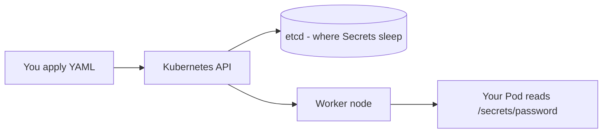
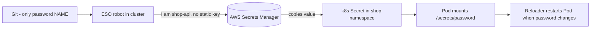
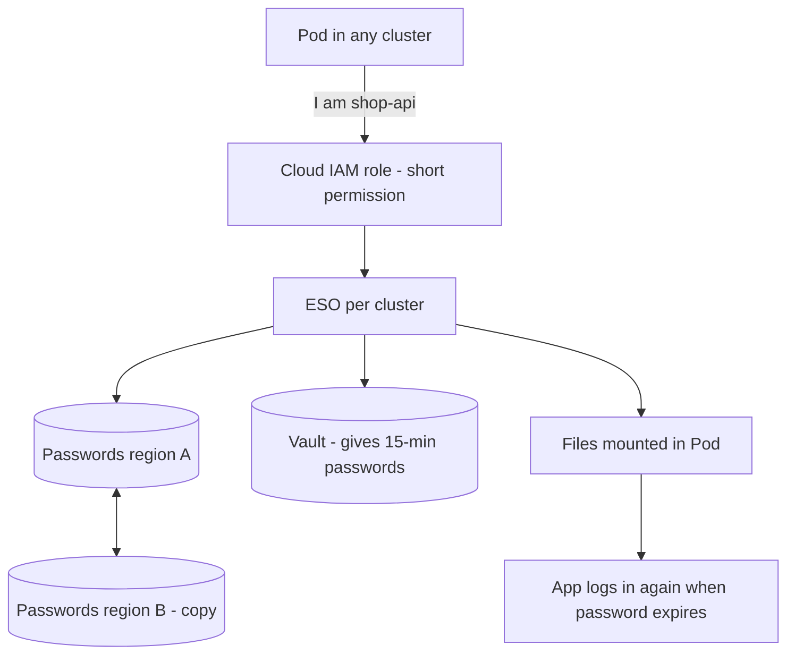

# Kubernetes Secret Management: Basics to Architect

## Level 1 — Basics

Your app needs a password to talk to the database. Where do you put it?

Not in code. Not in Docker image. Not in `ConfigMap` (everyone can read it). You put it in a `Secret`.

A `Secret` is a small object in Kubernetes that holds sensitive text. A `Pod` can read it as an environment variable or as a file.

Example — create a Secret:

```yaml
apiVersion: v1
kind: Secret
metadata:
  name: db-password
  namespace: shop
type: Opaque
stringData:
  password: "my-real-password-123"
```

Example — use it in a Pod as a file (preferred):

```yaml
spec:
  containers:
  - name: api
    image: my-api:1.0
    volumeMounts:
    - name: db-pass-vol
      mountPath: /secrets
      readOnly: true
  volumes:
  - name: db-pass-vol
    secret:
      secretName: db-password
```

Now the app reads `/secrets/password`. Why file and not env var? Env vars leak easily: they show up in logs, crash reports, `kubectl describe pod`. Files can be read-only and replaced without changing how the process starts.

Two hard truths:

1. **Secret YAML is not encrypted, only base64-encoded.** This:
   `echo "my-real-password-123" | base64` gives `bXktcmVhbC1wYXNzd29yZC0xMjM=`.
   Anyone who can run `kubectl get secret db-password -o yaml` can decode it in 2 seconds.

2. **Kubernetes saves all Secrets in a database called etcd.** If etcd has no encryption, and etcd backups go to S3 without encryption, then your password sits in plain text in two more places.



Words you need:
- **Secret** = the password object.
- **ServiceAccount** = ID card for a Pod.
- **RBAC** = rule book that says who can read which Secret.
- **etcd** = the hard disk of Kubernetes.

If you don't know who can read etcd backups, you don't know who can read your passwords.

## Level 2 — Production practitioner

### Why simple Secrets break in real companies

1. Someone commits the real password YAML to git. It stays in git history forever.
2. etcd is not encrypted. One S3 backup leak = all passwords leaked.
3. Too many people have access. Developers, CI jobs, Helm charts can read *all* Secrets in prod.
4. Password change breaks the app. You change the Secret, but Pods still use the old value until you restart them.
5. No one knows who read what. `Who saw prod DB password last week?` No answer.

### Your options, simple version

| Option | Where is the real password? | When to use it |
|---|---|---|
| Plain Secret | Only in Kubernetes | Toy project, local cluster |
| Secret + KMS encryption | In Kubernetes, but etcd is encrypted with a cloud key | One cluster, small team |
| Sealed Secrets | Git holds locked box, only cluster can open it | You want GitOps but have no Vault yet |
| External Secrets Operator (ESO) + AWS Secrets Manager or Vault | Real password lives outside Kubernetes, Kubernetes keeps a copy | **Use this in prod by default** |
| Secrets Store CSI Driver | Real password lives outside, Pod mounts it directly as file, no copy in etcd | You want maximum safety |

What is ESO? A small robot in your cluster. You tell it `copy password X from AWS to my namespace`. It does it again and again. Your git repo only has the *name* of the password, never the value.

What is IRSA / Workload Identity? A way to let a Pod say `I am shop-api` to AWS, without storing an AWS key. No key to leak.

Recommended setup for most teams:

```yaml
# Git holds THIS, safe to commit. No real password inside.
apiVersion: external-secrets.io/v1beta1
kind: ExternalSecret
metadata:
  name: db-password
  namespace: shop
spec:
  refreshInterval: 5m
  secretStoreRef:
    name: aws-store   # points to AWS Secrets Manager with IAM role
    kind: SecretStore
  target:
    name: db-password # the local k8s Secret ESO will create
  data:
  - secretKey: password
    remoteRef:
      key: prod/shop/db-password
```

Flow:



### Production checklist, in plain words

- **Turn on etcd encryption.** On EKS/GKE/AKS this is one checkbox + a KMS key per environment. If you can't tell me the key name, it's off.
- **Never put cloud keys inside Secrets.** If you see `AWS_SECRET_ACCESS_KEY` inside a k8s Secret, that's wrong. Use IRSA so the Pod borrows permission for a short time.
- **Give each app only its own Secrets.** `shop-api` can read `shop/db-password`, nothing else. Developers read nothing in prod. CI can deploy, but not read passwords back.
- **One password per app per environment.** `shop-prod-db` and `shop-dev-db` are two different secrets. If prod leaks, dev is still safe.
- **Fix password changes.** Pick one: Reloader (auto-restarts Pod when Secret changes) or let the app re-read the file. Test it. Change the password on staging first and watch what happens.
- **Log who reads passwords.** Turn on Kubernetes audit logs + AWS CloudTrail. If a human runs `kubectl get secret` in prod, you should get an alert.

### How this breaks (real cases)

- ESO robot dies or IAM role is wrong → new Pods never get passwords, they stay in `CreateContainerConfigError`. Fix: alert when ESO cannot sync for 5 minutes.
- You change DB password but forget to restart app → half Pods use old password, DB locks them out. Fix: always support two passwords for 10 minutes, restart in small batches.
- Password printed in logs. Now rotation is useless, attacker already has it. Fix: scan git + images for secrets, never `printenv` in prod.

## Level 3 — Architect: secrets for many teams and clusters

One cluster is easy. Twenty clusters and fifty teams is a different game. Same ideas, stricter:

- **No permanent passwords for important things.** Database passwords that live 1 year can leak for 1 year. Better: passwords that live 15 minutes (Vault dynamic secrets, RDS IAM auth, short AWS STS tokens). If it leaks, it dies fast. Your app must learn to log in again, not just once at startup.
- **Teams cannot see each other.** Platform team owns the ESO robot and the rules. Each team gets its own locked box: its own AWS account or Vault folder, its own key. If `team-A` token leaks, it cannot read `team-B` secrets.
- **Secrets must survive a region failure.** If `region-A` dies, `region-B` must still start Pods. That means copy secrets to the second region *before* the incident (Secrets Manager replication, Vault standby nodes). Failover that needs passwords from the dead region will fail.
- **Don't restart 5000 Pods at once.** When a common certificate expires, every Pod wants a new one at the same minute. That kills Vault. Fix: add random delay (jitter), cache copies, test expiry day like a fire drill.
- **Watch four numbers.** 1) Is ESO sync working? 2) How old is each secret? 3) How long from password change to Pod reload? 4) How many humans read secrets? Human reads in prod should be almost zero.
- **Have a break-glass key.** When Vault and ESO are both down, you still need to open the door. One emergency admin role, needs MFA + ticket, expires in 1 hour, every command recorded. Practice using it every 3 months.



## Rule of thumb

**Basics: never commit real passwords, Secret YAML is just base64, know where etcd backups go. Production: keep real passwords outside Kubernetes in AWS Secrets Manager or Vault, copy them with ESO, use files not env vars, encrypt etcd, give each app only its secrets, test password changes. Big scale: 15-minute passwords, teams isolated, secrets copied to two regions, don't restart everything at once, alert on human reads.**
